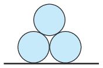

P. 5471. Három egyforma, $R$ sugarú, $m$ tömegű jéghengert készítünk, és azokat az  ábrán látható helyzetből kezdősebesség nélkül elengedjük. A jég felülete nagyon síkos, emiatt a súrlódás mindenhol elhanyagolható.

 $a)$ Határozzuk meg és ábrázoljuk vázlatosan az egyik alsó jéghenger mozgási energiáját a felső henger elmozdulásának függvényében!
 $b)$ Mekkora sebességgel csapódik a felső jéghenger a talajhoz, és mekkora sebességre gyorsul fel a másik két jéghenger?

