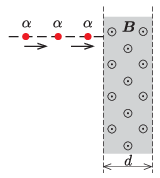

P. 5488. $\alpha$-részecskéket $10^6$ V feszültséggel felgyorsítunk, majd a nyalábot az  ábrának megfelelően merőlegesen egy $B=1{,}5$ T indukciójú, $d=7$ cm szélességű, homogén mágneses mezőbe irányítjuk.

 $a)$ Milyen szögben térülnek el a részecskék?
 $b)$ Mennyi időt töltenek a részecskék a mágneses térben?

