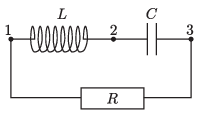

P. 5495. Az ábrának megfelelően egy $R = 100~\Omega$-os ellenállást, egy $L = 1$ mH önindukciójú tekercset és egy $C = 10~\mu$F kapacitású kondenzátort kapcsolunk össze. Az 1, 2, és 3-as pontok közül kettőre $f = 50$ Hz-es szinuszos feszültségforrást kapcsolunk. A három eset közül melyiknél fejlődik a legtöbb hő az ellenálláson?

