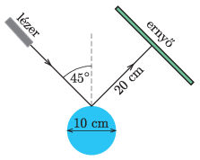

P. 5496. Az ábrán látható módon egy 10 cm átmérőjű, tükrözödő felületű hengert egy 5 mm átmerőjű lézersugárral világítunk meg. A visszaverődő lézersugárra merőlegesen egy ernyőt helyezünk el úgy, hogy a visszaverődési pont és az ernyő között a távolság 20 cm. Milyen alakú és méretű fényfolt keletkezik az ernyőn?

