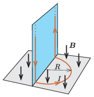

P. 5504. A vízszintes síkban lévő, $R$ sugarú félkör alakú vezetőben $I$ erősségű áram folyik, amelyet hosszú, függőleges huzalok vezetnek a félkörbe annak végpontjainál. Az egész elrendezés függőleges irányú, $\boldsymbol B$ indukcióvektorral jellemezhető homogén mágneses mezőben helyezkedik el.

 Mekkora és milyen irányú mágneses erő hat a huzalok együttesére?

