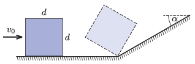

P. 5528. Vízszintes, súrlódásmentesnek tekinthető talajon egy $d=10~\mathrm{cm}$ oldalélű, homogén tömegeloszlású kocka csúszik $v_0$ sebességgel. Egyszer csak a kocka a talajhoz csatlakozó, $\alpha=30^\circ$ hajlásszögű lejtőhöz ér. A lejtő és a talaj ,,törésvonala'' merőleges a kocka haladási irányára. A kocka talajjal érintkező, első oldaléle a törésvonalnál tökéletesen rugalmatlanul megakad, így a kocka megbillen. Legalább mekkora $v_0$ értéke, ha a kocka elülső oldallapja ,,rábillen'' a lejtőre?

