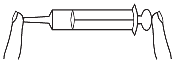

P. 5530. Egy orvosi fecskendő dugattyújának $300~\mathrm{mm^2}$, kivezető csöve üregének pedig $4~\mathrm{mm^2}$ a keresztmetszete. A nyitott végű eszköz dugattyújának megmozdításához (a tapadási súrlódás legyőzéséhez) $1{,}4~\mathrm{N}$ erő szükséges. Miután a kivezető csövet az  ábra szerint egyik ujjunkkal befogtuk, a dugattyút egy másik ujjunkkal nagyon lassan befelé toljuk úgy, hogy egyéb helyen nem érünk a végig nyugalomban lévő fecskendőhöz (lásd az ábrát). A teljes folyamat során a bezárt levegő térfogata $20~\mathrm{cm^3}$-ről $15~\mathrm{cm^3}$-re csökken.

 $a$) Mennyi a dugattyú betolását követően a bezárt levegő nyomása?
 $b$) Legalább mekkora erővel kell szorítanunk ekkor a fecskendő kivezető csövének végét?
 (A külső légnyomás $100~\mathrm{kPa}$, a fecskendő súlyától eltekinthetünk.)

