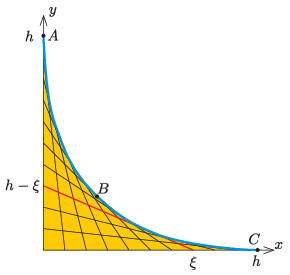

P. 5534. Legyen egy derékszögű koordináta-rendszer $x$ tengelye vízszintes, $y$ tengelye pedig függőleges. Az $x$ tengely $0\le \xi\le h=1~\mathrm{m}$ minden egyes $x=\xi$ pontját kössük össze az $y$ tengelyen lévő $y=h-\xi$ ponttal. Fektessünk egy súrlódásmentes, vékony csövet az előzőek szerint felvett szakaszokból kialakuló sárga ,,síkidom'' burkolójára.

 Indítsunk el lökésmentesen egy $m$ tömegű, kicsiny testet a cső tetejéről. Adjuk meg $mg$ egységekben, hogy a mozgása során mekkora erővel nyomja a test a cső falát
 $a)$ közvetlenül az indulás után az $A$ pontban;
 $b)$ a cső $B$ felezőpontjánál;
 $c)$ közvetlenül a cső elhagyása előtt a $C$ pontnál!

