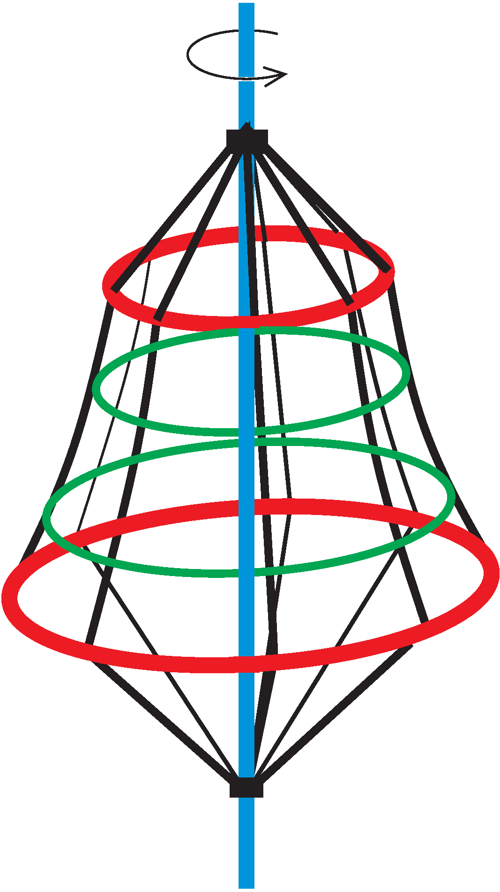

P. 5538. Sok játszótéren találunk az ábrához hasonló, forgatható mászókát. Egy ilyen mászókán egy hangya mászik fel, miközben az egyenletesen forog. A felfelé kapaszkodó hangya folyamatosan azt érzi, hogy ,,függőlegesen fölfelé'' mászik.

 A mászóka köteleit tartó, piros körgyűrűk közül az alsó sugara $2~\text{m}$, a felsőé $1~\text{m}$, és a gyűrűk távolsága $3~\text{m}$. Mekkora fordulatszámmal forog a mászóka?

