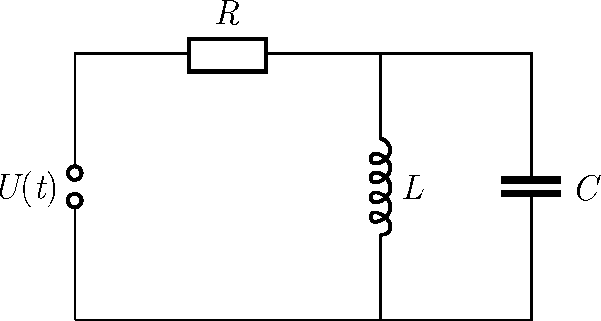

P. 5542. Egy $R$ ellenállásból, egy $L$ induktivitású tekercsből, egy $C$ kapacitású kondenzátorból és egy $U(t)=U_0\sin(\omega t)$ feszültségű generátorból az ábrán látható egyszerű áramkört hozzuk létre.

 $a)$ Mekkora az ellenálláson átfolyó áram amplitúdója?
 $b)$ Hogyan válasszuk meg az $\omega$ körfrekvenciát ahhoz, hogy az ellenálláson ne folyjon áram?

