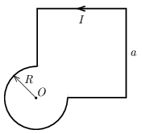

P. 5558. Az ábrán látható háromnegyed kör sugara $R$, a hiányos négyzet oldalainak hosszúsága $a$. A zárt vezető körben $I$ erősségű áram folyik. Határozzuk meg a mágneses indukcióvektor értékét a kör $O$ középpontjában!

 Útmutatás : Egy $\ell$ oldalhosszúságú, $I$ árammal átjárt, négyzet alakú vezetőkeret középpontjában a mágneses indukció értéke:
 $B=\frac{2\sqrt{2}\mu_0I}{\pi\ell}.
$

