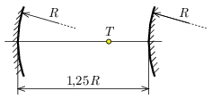

P. 5559. Kis nyílásszögű, $R$ sugarú homorú és domború gömbtükröket az ábrán látható módon helyezünk el egymástól $1{,}25 R$ távolságra.

 A közös optikai tengely mely $T$ pontjába helyezzünk egy pontszerű fényforrást, hogy a belőle induló fénysugarak a két tükörről való visszaverődés után a $T$ ponton menjenek át?

