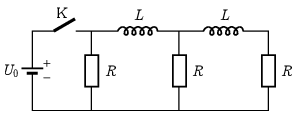

P. 5570. Az ábrán látható – három egyforma ellenállást és két egyforma tekercset tartalmazó – hálózatot viszonylag hosszú ideje egyenáramú forrásra kapcsoltuk. (A tekercsek ohmikus ellenállása elhanyagolható.)

 $a)$ Mekkora áram fog folyni az ellenállásokon közvetlenül a K kapcsoló kikapcsolása után?
 $b)$ Mekkora feszültség indukálódik a tekercsekben közvetlenül a K kapcsoló kikapcsolása után?
 $c)$ Hogyan változik időben a tekercseken folyó áramerősségek összege, illetve különbsége?
 $d)$ Mennyi idő múlva csökken az egyik, illetve a másik tekercs áramerőssége a K kapcsoló kikapcsolása után nagyon hamar mérhető áramerősség felére?
 Adatok: $U_0=1~\mathrm{V}$, $L=1~\mathrm{H}$, $R=1~\Omega$.
 Károlyházy Frigyes (1929-2012) feladata nyomán

