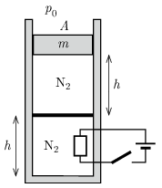

P. 5574. Alul zárt, függőleges, hőszigetelt hengerben lévő dugattyúk azonos hőmérsékletű és térfogatú nitrogént zárnak el. Kezdetben a hőmérséklet $T_1=300~\mathrm{K}$. A felső dugattyú súrlódásmentesen mozoghat, a tömege $m=40~\mathrm{kg}$, az alsó jó hővezető anyagból készült és rögzített, a felső hőszigetelt. A külső légnyomás $10^5~\mathrm{Pa}$, az alsó gáz nyomása $1{,}2\cdot 10^5~\mathrm{Pa}$, a henger alapterülete $A=1~\mathrm{dm^2}$, $h=0{,}5~\mathrm{m}$.

 $a)$ Mennyi a felső és az alsó részben lévő nitrogén tömege?
 A fűtőszál $Q=1580~\mathrm{J}$ hőt közöl a rendszerrel.
 $b)$ Mennyivel változik meg a felső és az alsó gáz belső energiája?
 $c)$ Mennyivel változik meg a felső gáz térfogata?

