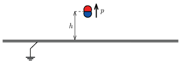

P. 5575. Nagy méretű, földelt fémlap felett $h$ magasságban egy kicsiny elektromos dipólust helyezünk el. Mindezt úgy tesszük, hogy annak $\boldsymbol{p}$ dipólmomentuma az ábrán látott módon felfelé mutasson.

 Határozzuk meg a fémlapon azon pontok helyét, ahol a felületi töltéssűrűség zérus!

