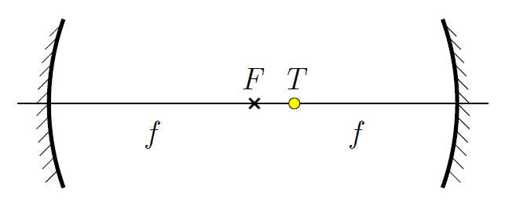

P. 5595. Két, kis nyílásszögű, $f$ fókusztávolságú homorú tükröt tükröző felületeikkel szemben úgy helyezünk el, hogy optikai tengelyeik egybeessenek, és egymástól való távolságuk $2f$ legyen (lásd ábra ).

 A közös optikai tengelyre hová helyezzük a $T$, pontszerűnek tekinthető fényforrást, hogy a belőle induló fénysugarak a két tükörről való visszaverődés után a $T$ ponton menjenek át?

