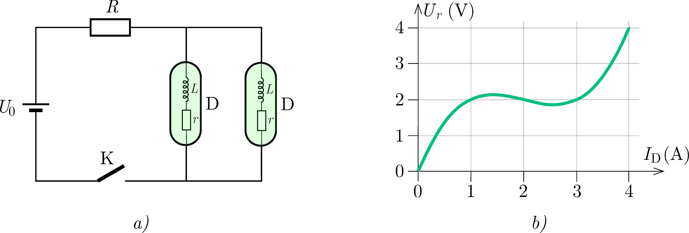

P. 5615. Egy $U_0=4~\mathrm{V}$ feszültségű ideális telep, egy $R=0{,}5~\Omega$ ellenállású fogyasztó, egy kapcsoló és két dürisztor (D) felhasználásával az a) ábrán látható kapcsolást állítjuk össze. A dürisztor egy olyan áramköri elem, amely egy $L=1~\mathrm{H}$ induktivitású ideális tekercs és egy nemlineáris $r$ ellenállás soros kapcsolásából áll. Az ellenállás $U_r(I_\mathrm{D})$ karakterisztikáját a b) ábra mutatja.

 a) Mekkorák lehetnek stacionárius (azaz időben állandó) esetben a mellékágakban folyó áramok?
 Segítség: Lásd a P. 5604. feladatot és annak megoldását a munkafüzetben.

 b) A $t=0$ pillanatban bekapcsoljuk a kapcsolót. Vázoljuk fel a dürisztorokon átfolyó áramokat az idő függvényében. Mekkorák lesznek ezek az áramok hosszabb idő után?
 Segítség: Tegyük fel, hogy eközben a szimmetria miatt a két dürisztoron azonos áram folyik.

 c) Az egyensúlyi állapotban egy kis zavar keletkezik: az egyik dürisztor árama egy nagyon kicsit lecsökken, a másiké pedig ugyanennyivel megnő. Vázoljuk fel a két dürisztor áramát ezután az idő függvényében. Mekkorák lesznek az egyes dürisztorok áramai hosszabb idő után? Mit állíthatunk az a) kérdésben megadott stacionárius megoldások stabilitásáról?
 Segítség: Felhasználhatjuk, hogy ha a kis zavar az első egyensúlyi állapothoz képest szimmetrikus, akkor a két dürisztor áramának összege állandó marad.
 Dürer Verseny feladata nyomán

