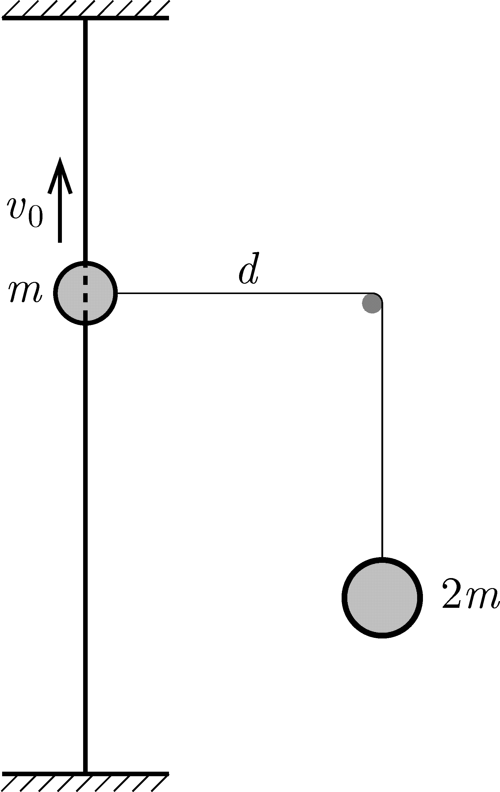

P. 5618. Egy $m$ tömegű gyöngyöt fűztünk egy elegendően hosszú, függőleges helyzetű, rögzített, feszes drótra, amelyhez egy fonalat erősítettünk. A fonalat, az ábra szerint egy vízszintes rúdon átvetettünk, és függőleges darabjának végéhez egy kicsiny, $2m$ tömegű nehezéket rögzítettünk. A rúd a dróttól $d$ távolságra van. A gyöngyhöz kapcsolódó fonalszál vízszintes helyzetében a gyöngynek felfelé mutató, $v_0=\sqrt{2gd}$ nagyságú kezdősebességet adunk.

 a) A gyöngy legfelső helyzetének a kiindulási ponttól való távolsága legyen $f$, a legalsó helyzetének a kiindulási ponttól való távolsága pedig $\ell$. Mekkora az $\ell/f$ hányados?

 b) Mekkora a fonálban ébredő erő a gyöngy legfelső helyzetében és a kiindulási ponton való áthaladáskor?

 (A súrlódás mindenhol elhanyagolható.)

