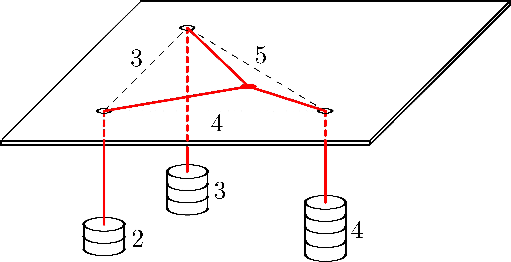

P. 5671. Vízszintes síkban rögzített lemezen három kicsiny lyuk van, távolságuk $3$, $4$ és $5$ egységnyi. Három vékony, hajlékony fonál egy-egy végét összecsomózzuk, a másik végüket pedig a lyukakon átfűzzük, majd a lelógó végükre (az ábrán látható módon) $2$, $3$ és $4$ egységnyi tömeget akasztunk. A fonalak és az asztal közötti súrlódás elhanyagolható.

 Szerkesszük meg (körzővel és vonalzóval vagy a GeoGebra program segítségével), hogy egyensúlyi helyzetben hol lesz a csomó!

