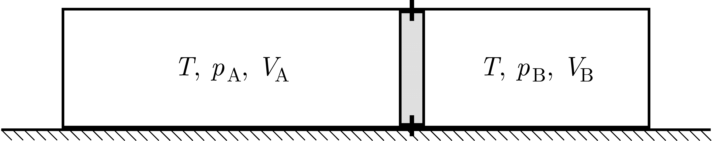

P. 5673. Egy jó hőszigetelt falú, vízszintes helyzetű, rögzített, henger alakú tartályban lévő levegőt súrlódásmentesen mozgó, szintén jó hőszigetelő anyagból készült, $0{,}5~\mathrm{kg}$ tömegű dugattyú oszt két részre ( ábra ). Kezdetben a dugattyú olyan helyzetben rögzített, hogy a bal oldali részben a levegő térfogata $3~\mathrm{dm}^3$, nyomása $100~\mathrm{kPa}$, a másik részben pedig $2~\mathrm{dm}^3$ és $200~\mathrm{kPa}$. Ekkor mindkét részben a levegő hőmérséklete $300~\mathrm{K}$.

 A dugattyú rögzítését megszüntetjük.

 a) A rögzítés megszüntetését követően a dugattyú mekkora maximális sebességre gyorsul fel?

 b) Mekkora lesz a bal oldali légoszlop legmagasabb hőmérséklete?

