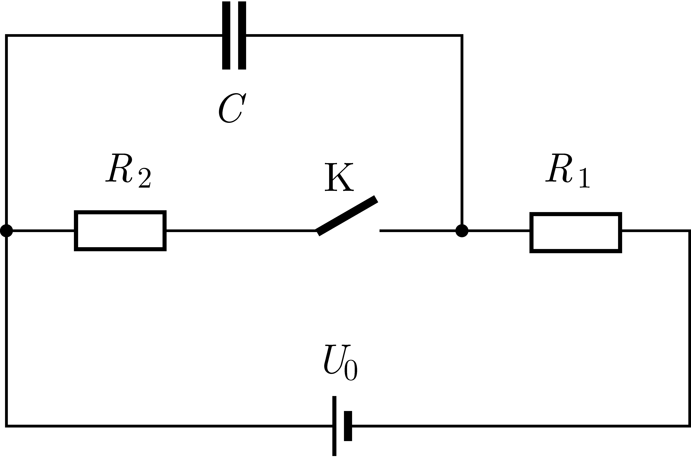

P. 5676. Az ábrán látható kapcsolási rajz szerint összeállított áramkörben szereplő feszültségforrás elektromotoros ereje $20~\mathrm{V}$, az ellenállások $R_1=50~\Omega$, illetve $R_2=150~\Omega$ nagyságúak, a kondenzátor $20~\mu\mathrm{F}$ kapacitású. Kezdetben a K kapcsoló zárva van.

 a) Mekkora a kondenzátor töltése a kapcsoló zárt állása esetén?

 b) A kapcsoló nyitását követően kialakuló állandósult állapot eléréséig mennyivel változik meg a kondenzátor energiája, és mennyi hő fejlődik az $R_1$ ellenálláson?

 A feszültségforrás belső ellenállása elhanyagolható.

 Tornyai Sándor fizikaverseny, Hódmezővásárhely

