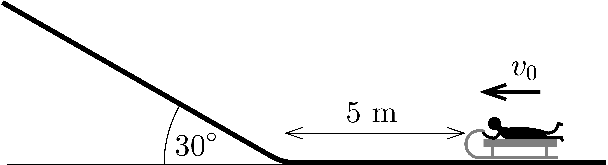

P. 5680. Amikor a $30^\circ$-os hajlásszögű, vízszintes síkban folytatódó domboldalt mindenütt hó borította, Peti szokatlan módját választotta a szánkózásnak: az emelkedő aljától számított 5 m távolságból különböző kezdősebességgel indult el.

 a) Mekkora kezdősebesség esetében áll meg leghamarabb a szánkó?

 b) Milyen hosszú utat tett meg felfelé az emelkedőn ebben az esetben a szánkó?

 A szánkó pályája egybeesett a domboldal esésvonalával. A lejtő töréspontmentesen csatlakozik a vízszintes felülethez. A szánkó és a hó között a súrlódás elhanyagolható.
 Tornyai Sándor fizikaverseny, Hódmezővásárhely

