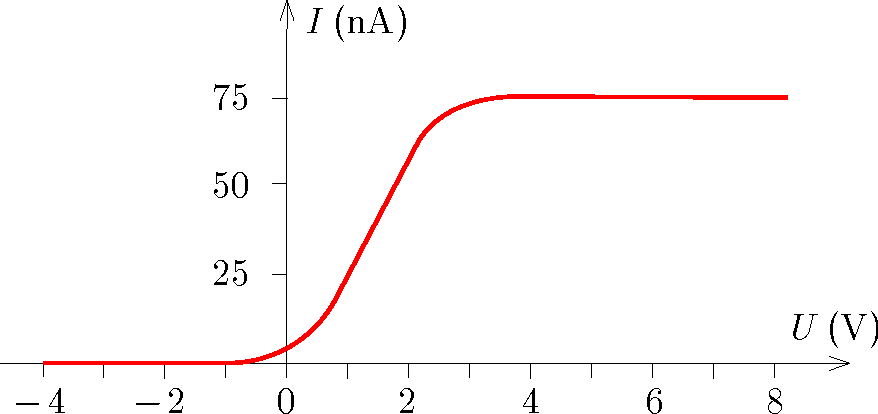

P. 5695. Állandó teljesítményű, 420 nm hullámhosszúságú fénynyalábbal cézium katódú vákuum-fotocellát világítunk meg. Az alábbi grafikon mutatja a fotocella fotoáramának $I$ erősségét az anód katódhoz viszonyított $U$ feszültségének függvényében.

 a) Mekkora a cézium kilépési munkája?

 b) Legalább mekkora teljesítményű fénynyaláb érkezett a fotocella katódjára?
 Tornyai Sándor fizikaverseny, Hódmezővásárhely

