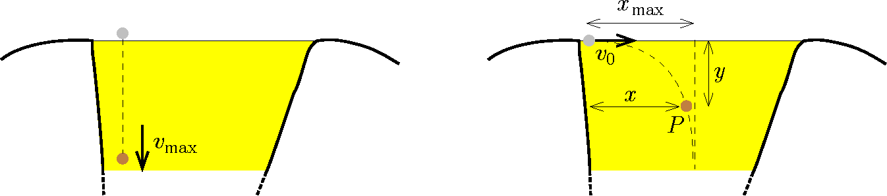

P. 5705. A kis herceg egy különös bolygóra tévedt, ahol leült játszani egy méztó partjára. Azonos méretű, $m$ tömegű kavicsokat hajigált a nagyon mély tóba. Megfigyelte, hogy ha közvetlenül a tófelszín felett ejtett el egy kavicsot, az legfeljebb $v_{\mathrm{max}}$ sebességre gyorsult fel a mézben. (Feltételezhető, hogy a kavicsra ható közegellenállási erő nagysága egyenesen arányos a kavics sebességével.)
 Ezután a kis herceg a partról úgy dob egy kavicsot a tóba, hogy az a part közvetlen közelében $v_0$ nagyságú, közel vízszintes irányú sebességgel érkezik a mézbe. Kiszámítja, hogy a kavics a parttól (vízszintesen mérve) legfeljebb $x_{\mathrm{max}}$ távolságban érhet a tó fenekére.

 a) Mekkora $y$ mélységbe jut el a kavics, mialatt vízszintes irányban mérve $x<x_{\mathrm{max}}$ távol kerül a parttól?

 b) Mekkora a közegellenállási erő munkája a kavicson, mialatt az a parttól $x$ távol és $y$ mélyen található $P$ pontig süllyed le a mézben?

 A kis herceg az eredményeket a $v_0$, $v_{\mathrm{max}}$ $x_{\mathrm{max}}$ paraméterekkel, valamint az $x$ változóval kifejezve adta meg, miközben felhasználta az alábbi integrálformulákat:
$$\begin{gather*}
\int\limits_0^a\frac{1}{1-u}~\mathrm{d}u=\ln\frac{1}{1-a},\qquad\int\limits_0^a\frac{u}{1-u}~\mathrm{d}u=\ln\frac{1}{1-a}-a,\\
\int\limits_0^a \frac{u^2}{1-u}~\mathrm{d}u=\ln\frac{1}{1-a}-a-\frac{a^2}{2}.
\end{gather*}$$
 Saint-Exupéry regénye nyomán

