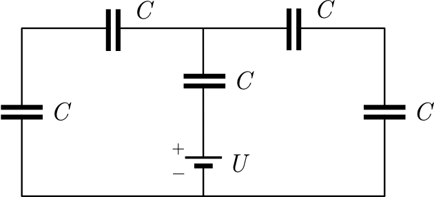

P. 5711. Öt egyforma $C$ kapacitású kondenzátor és egy $U$ belső feszültségű ideális telep felhasználásával az ábrán látható egyszerű áramkört hozzuk létre.

 a) Mekkora töltés halmozódik fel a középső kondenzátor fegyverzetein?
 b) Hogyan változik ez az érték, ha az egyik kondenzátort $nC$ kapacitású kondenzátorra cseréljük?

