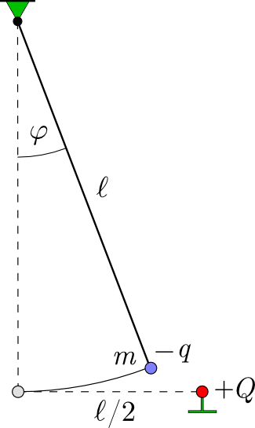

P. 5714. Egy $m$ tömegű kicsiny golyócskát $\ell$ hosszúságú, vékony selyemszálra függesztettünk fel. Ugyanolyan magasságban, tőle $\ell/2$ távolságban egy másik, szigetelőállványra rögzített, kicsiny fémgömb található, amire egy elektrosztatikus gép segítségével különböző ${+Q}$ pozitív töltést juttathatunk. A szigetelőszálon függő golyócska ${-q}$ negatív töltéssel rendelkezik.
 A $Q$ töltés nagyságát nagyon lassan változtatjuk, és mindig megvárjuk, hogy az inga egyensúlyi helyzetbe kerüljön. A selyemfonálnak a függőlegessel bezárt $\varphi$ szöge a $Q$ töltésnek valamilyen $\varphi(Q)$ függvénye.

 a) Nagyon kicsi $Q$ esetén $\varphi$ is nagyon kicsi, és a kitérés szöge jó közelítéssel a $Q$ töltéssel arányosan változik: $\varphi\approx{\tfrac{1}{Q_0}\cdot Q}$, ahol $Q_0$ egy töltés dimenziójú állandó. Hogyan fejezhető ki $Q_0$ a feladat többi ($m$, $g$, $\ell$ és $q$) paraméterével?
 b) Hány stabil egyensúlyi helyzet tartozik nagyon kicsi, nagyon nagy és közepes nagyságú $Q$ töltéshez? Adjunk vázlatos (kvalitatív) leírást a $\varphi(Q/Q_0)$ függvény menetére, ha a $Q$ töltést nulláról nagy ($Q\gg Q_0$) értékre növeljük, majd onnan ismét nullára csökkentjük.
 c) Részletes számítással ellenőrizzük, hogy helyesek-e a kvalitatív megfontolások, és adjuk meg számszerűen is a szög­kitérés-töltés függvény grafikon jellegzetes pontjainak koordinátáit!
 Szabó Endre (Vágfüzes, Szlovákia) javaslata alapján

