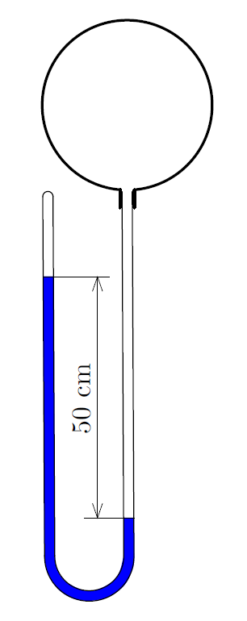

P. 5718. Tamás és Balázs felfújás előtt $1{,}5~\mathrm{g}$-nak mérte egy gumiból készült léggömb tömegét. Felfújást követően a bekötött, $8{,}0~\mathrm{dm}^3$ térfogatú, gömb alakú lufit ismét mérlegre tették: ezúttal a mérés eredménye $2{,}0~\mathrm{g}$ lett. Végül a felfújt léggömb száját egy mindkét végén nyitott, U-alakban meghajlított, vékony, vízzel részben megtöltött üvegcső egyik végére csatlakoztatva és a bekötést feloldva azt tapasztalták, hogy a cső két szárában lévő vízszintek között 50 cm különbség alakult ki.

 a) Hány vízcentiméter a felfújt léggömbbe zárt levegő abszolút nyomása?

 b) Balázs szerint a befújt levegő tömege a mérlegelésnél kapott értékek különbsége, azaz $0{,}5~\mathrm{g}$. Tamás viszont azt állítja, hogy a léggömb felfújt állapotában jóval több, csaknem 10 g levegőt tartalmaz. Melyik fiúnak van igaza? Hány gramm levegő került a léggömbbe?

 A mérések helyszínén a légnyomás $10^5~\mathrm{Pa}$, a hőmérséklet $27~{}^{\circ}\mathrm{C}$. A levegő moláris tömege $29~\mathrm{g}/\mathrm{mol}$, a víz sűrűsége $1~\mathrm{g}/\mathrm{cm}^3$.
 Tornyai Sándor fizikaverseny, Hódmezővásárhely

