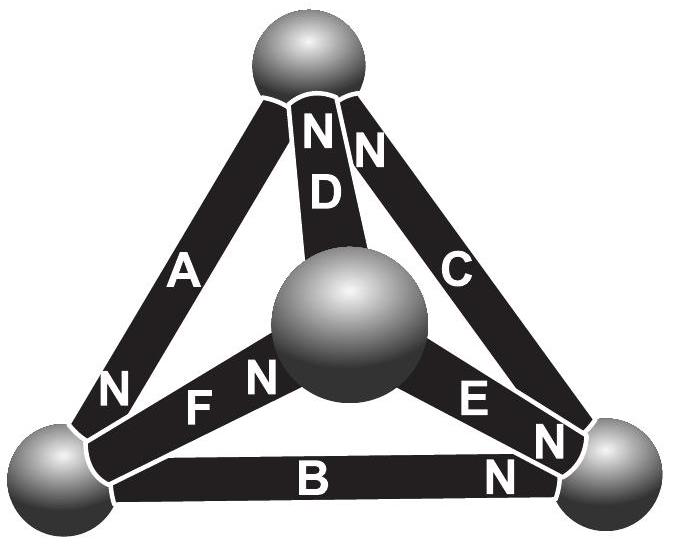

**6. MÁGNESEK (6 pont)**

Bizonyos mágneses játékok ferromágneses gömbökből és hengeres alakú állandó
mágnesekből állnak. Ezekből az építőelemekből például tetraéder is készíthető; lásd
az ábrát (az „N” betű a mágnes északi végét jelöli). Tételezzük fel, hogy ezek az
állandó mágnesek egyformák, és mindegyikük önmagában $\Phi$ mágneses fluxust képes
létrehozni (feltéve, hogy a mágnes mindkét vége érintkezik egy nagy, U alakú
ferromágneses darabbal, így zárt ferromágneses kör alakul ki). Tételezzük fel azt
is, hogy az építőelemek anyagának nagy mágneses permeabilitása miatt az összes
mágneses erővonal az építőelemeken belül marad (azaz a környező közegben a
mágneses indukció $B=0$).

**1)** Jelöljük a rajzon szereplő állandó mágnesek (A–F mágnesek) fluxusait
$\Phi_A,\ldots,\Phi_F$-fel! Írj fel egyenletet, amely $\Phi_A$, $\Phi_B$ és
$\Phi_C$ között áll fenn (és esetleg $\Phi$-t is tartalmazza) (1 pont)!

**2)** Írj fel egyenletet, amely $\Phi_A$, $\Phi_B$ és $\Phi_F$ között áll fenn
(és esetleg $\Phi$-t is tartalmazza) (1 pont)!

**3)** Határozd meg a $\Phi_F/\Phi_C$ arányt (1 pont)!

**4)** Határozd meg az egyes állandó mágnesekben lévő mágneses fluxusokat (2 pont)!

**5)** Melyik mágnest a legnehezebb eltávolítani? Indokold a válaszodat (1 pont)!
