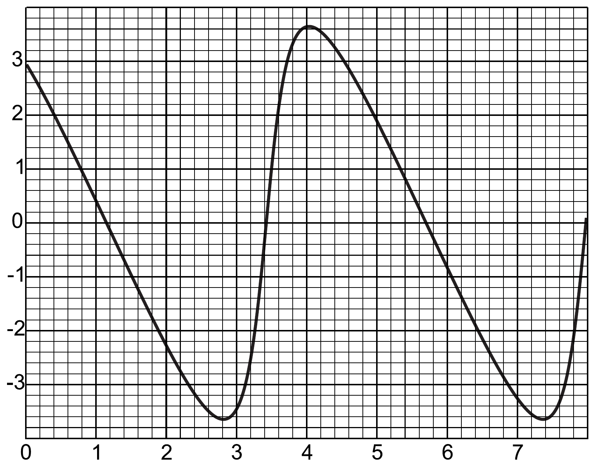

**2. BOLYGÓK (6 pont)**

Két bolygó körpályán kering egy $M=2.0 \cdot 10^{30}\ \mathrm{kg}$ tömegű csillag
körül; a gravitációs állandó $G=6.67 \cdot 10^{-11}\ \mathrm{m}^{3}/\mathrm{kg}\cdot\mathrm{s}^{2}$.
Egy bolygó és a csillag közötti
szögtávolság időfüggését, a másik bolygóról nézve, az ábra mutatja.

**1)** Mekkora a bolygók pályasugarainak $k$ aránya (2 pont)?

**2)** Határozd meg a függőleges tengelyen szereplő egység értékét (vagy fejezd ki
$k$ segítségével, ha ezt nem sikerült meghatároznod) (2 pont)!

**3)** Mekkora a bolygók pályasugara, ha a vízszintes tengely egysége egy évnek
felel meg (2 pont)?
