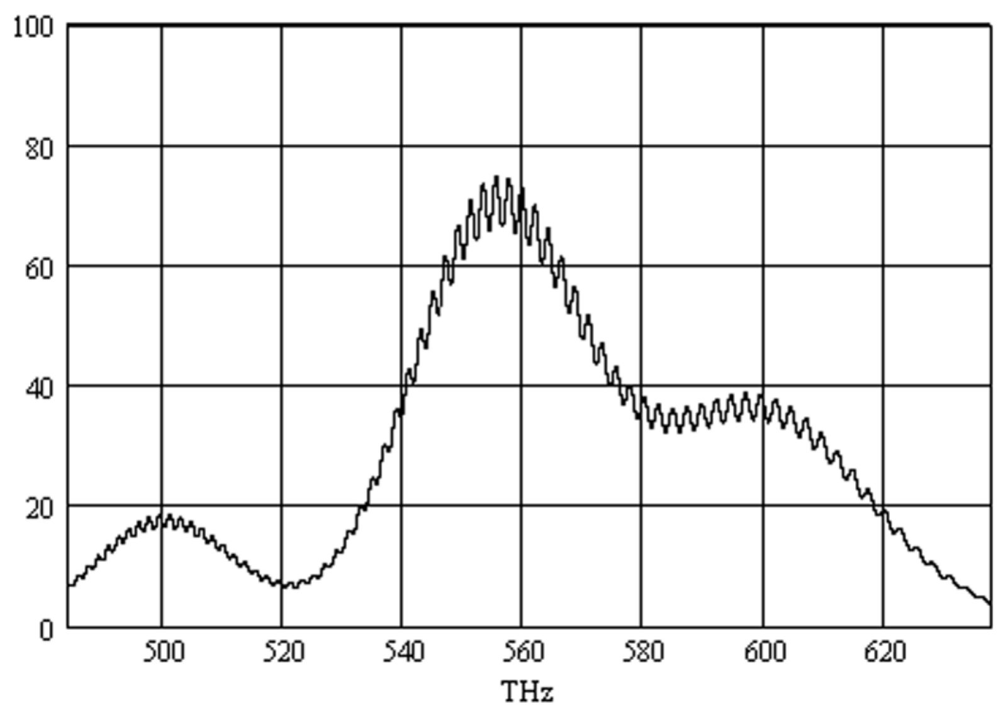

**4. ÁTLÁTSZÓ RÉTEG (6 pont)**

Egy vastag üveglemezt vékony, átlátszó réteggel vonunk be. A rendszer áteresztési
spektruma az ábrán látható (a fény merőlegesen esik a lemezre). A réteg törésmutatója
$n \approx 1.3$. Mekkora a réteg $d$ vastagsága?

