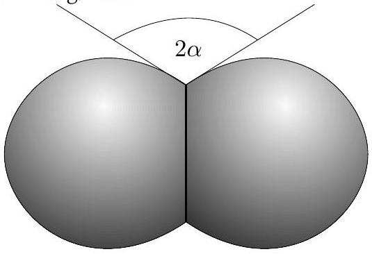

**8. Léggömb (8 pont)**

Határozd meg a léggömb (a benne lévő gázt is beleértve) tömegét.

**Felszerelés:** léggömb (a levegőben lebeg), digitális mérleg, kötél, mérőszalag, kötélrögzítők, dinamométer, hajtogatáshoz és durva szögméréshez használható papírlapok, 100 g-os súly, fonal.

**Megjegyzés:** Hasznos lehet tudni, hogy ha egy kötelet úgy kötünk a léggömb köré, hogy a kötél feszítőereje $T$, a léggömb belsejében a túlnyomás $\Delta p$, a kötél közelében a léggömb burkolatának érintői által bezárt szög (a kerület mentén átlagolva) $2\alpha$, és a kötél által létrehozott kör sugara $R$, akkor $\Delta p=T\tan\alpha/R^{2}$. Az egyetemes gázállandó $R=8.31\ \mathrm{J/(K\cdot mol)}$, a levegő moláris tömege $\mu=29\ \mathrm{g/mol}$.

