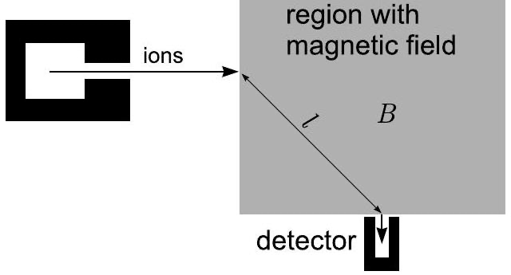

**7. TÖMEGSPEKTROMÉTER (9 pont)**

Az alábbi ábrán egy tömegspektrométer egyszerűsített sémája látható. Ez az eszköz molekulák tömegének mérésére szolgál. A vizsgálandó anyagot egy $T$ hőmérsékletre felhevített forró szálon ionizálják (a molekulák egyszeres elektronionizáción mennek keresztül).

Az ionokat $U$ feszültséggel gyorsítják. Egyelőre hanyagoljuk el az ionok termikus energiáját ($e U \gg k T$, ahol $e$ az elemi töltés, $k$ pedig a Boltzmann-állandó). A gyorsított ionok keskeny nyalábja mágneses térrel rendelkező tartományba lép. Az egyszerűség kedvéért tegyük fel, hogy a tartomány téglalap alakú, és benne a mágneses tér homogén. A mágneses tér eltéríti az ionokat, és azok tömegétől függően eltalálhatják a detektort. Tegyük fel, hogy a detektor közepébe érkező ionok merőlegesen lépnek be a mágneses tér tartományának határán, és merőlegesen lépnek ki onnan; a belépési és kilépési pontok távolsága $l$ (lásd az ábrát).

**1)** Fejezze ki a detektor közepébe érkező ionok $M$ tömegét a $B$, $l$, $U$ és $e$ mennyiségekkel.

**2)** A detektor bejárata egy $r$ sugarú kör ($r \ll l$). A detektor véges méretű bejárata miatt az $M-\Delta M$ és $M+\Delta M$ közötti tömegű ionok beléphetnek a detektorba; határozza meg a tartomány szélességét, $\Delta M$-et.

**3)** Az előző kérdés feltételei mellett mekkora a kilépési szögek $\Delta \varphi$ tartománya azoknál az ionoknál, amelyek még eltalálhatják a detektort?

**4)** Most tegyük fel, hogy $r$ elhanyagolhatóan kicsi, de a termikus hatásokat nem hagyhatjuk figyelmen kívül (továbbra is $e U \gg k T$). Az energiák különbsége miatt különböző tömegű ionok találhatják el a detektort, az $M-\delta M$ és $M+\delta M$ közötti tartományban. Mi a tömegspektrométer felbontása, $\delta M$?

