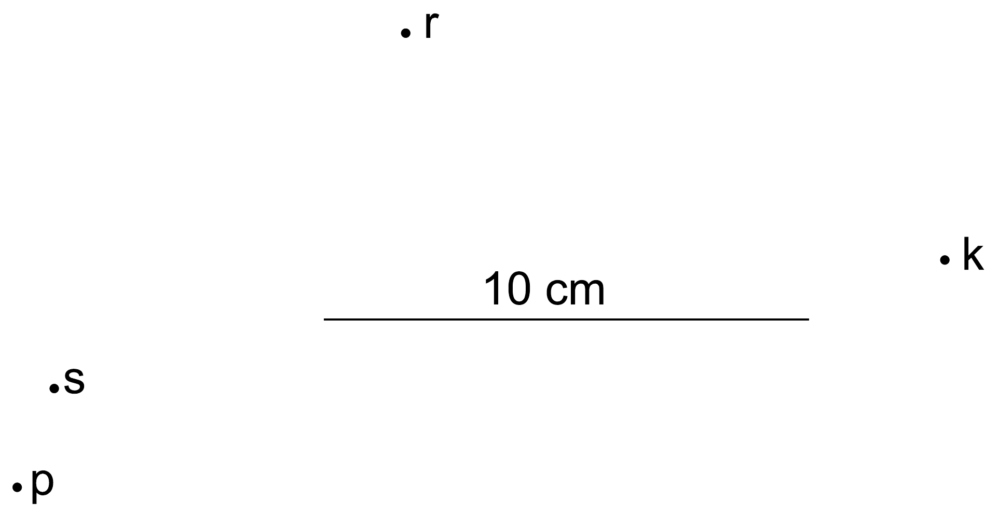

**5. FORGÓ KORONG (7 pont)**

Egy lámpa egy korong széléhez van erősítve; a korong a jégen csúszva forog. A
lámpa fényimpulzusokat bocsát ki: az egyes impulzusok időtartama elhanyagolható,
két impulzus között $\tau=100 \mathrm{~ms}$ idő telik el. Az első impulzus
narancssárga, a következő kék, majd vörös, zöld, sárga, aztán ismét narancssárga
(a folyamat periodikusan ismétlődik). A korong mozgását olyan hosszú expozíciós
idővel fényképezzük, hogy a fényképen pontosan négy impulzus jelenik meg (lásd az
ábrát). Az impulzusok rövid időtartama és a lámpa kis mérete miatt minden
impulzus egy színes pontnak felel meg a fényképen. A pontok színeit a következő
betűk jelölik: O – narancssárga, S – kék, P – vörös, R – zöld és K – sárga. A
korongra ható súrlódási erők elhanyagolhatók.

1) Számozd meg az ábrán 1-től 4-ig az impulzusok (pontok) sorrendjét! Indokold a
válaszodat! Mit mondhatsz az expozíciós idő értékéről?

2) A megadott ábra segítségével határozd meg a korong $R$ sugarát, a korong
középpontjának $v$ sebességét és a $\omega$ szögsebességet (adott, hogy
$\omega<60 \mathrm{rad} / \mathrm{s}$). Az ábra méretarányát egy $l=10 \mathrm{~cm}$
hosszúságú szakasz képe adja meg.

