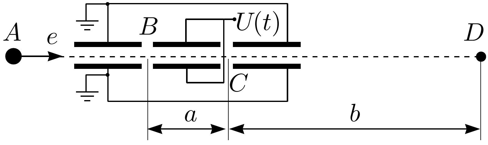

**3. IDŐBELI FÓKUSZÁLÁS (10 pont)**

Tegyük fel, hogy az $A$ pontban elhanyagolható hőenergiájú termikus elektronforrás
található. Az elektronokat kezdetben a $U_{0}=36 \mathrm{~V}$ feszültség gyorsítja
vízszintes irányban (lásd az ábrát). Az elektronok útjában két, elhanyagolható
szélességű $B$ és $C$ feszültséghézag található, egymástól $a$ távolságra. A
hézagokra egy jelgenerátor $U_{C}(t)=-U_{B}(t) \equiv U(t)$ feszültségjelet ad.
Feltehetjük, hogy $|U(t)| \ll U_{0}$. A különböző időpontokban induló elektronokat
a $D$ szondánál kell összegyűjteni (fókuszálni), amely a $C$ hézagtól $b$
távolságra található. A berendezés elemzéséhez válaszolj a következő kérdésekre!

1) Ha $U(t) \equiv 0$, mennyi idő szükséges az elektronoknak ahhoz, hogy a $B$
hézagtól a $D$ szondáig eljussanak?

2) Határozd meg ugyanezt az utazási időt, ha az $U(t) \equiv U \ll U_{0}$
feszültség állandó (a közelítő kifejezésed legyen $U$-nak lineáris függvénye)!

3) Milyen funkcionális egyenletet kell kielégítenie az $U(t)$ jelalaknak ahhoz,
hogy biztosítsa az összes elektron fókuszálását a $D$ szondánál? Oldd meg ezt az
egyenletet az $a \ll b$ és $|U(t)| \ll U_{0}$ feltételezések mellett!

4) A jelgenerátor $T$ periódusú periodikus jelet ad, amelyben az $U(t)$ alakja
egy bizonyos maximális $U_{m}$ érték eléréséig követhető; ezután a feszültség
azonnal 0-ra esik, és a folyamat ismétlődik. Az elektronok mekkora hányada nem
kerül időben fókuszba a $D$ szondánál?

