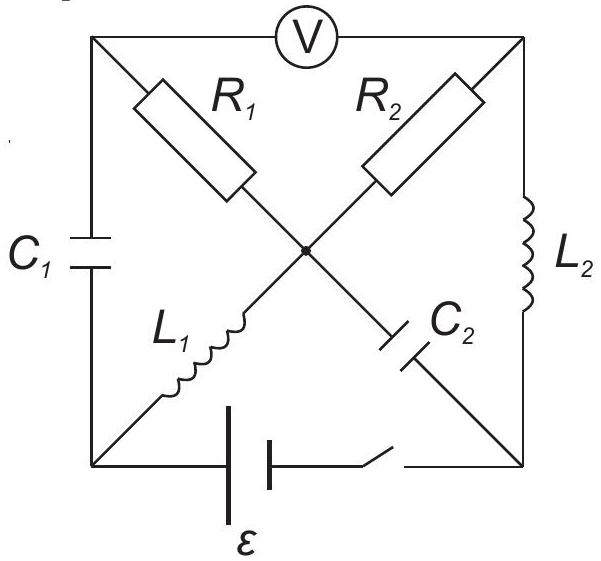

Az ábrán látható áramkörnél $R_{1}=3 R$, $R_{2}=R$, $C_{1}=C_{2}=C$ és $L_{1}=L_{2}=L$. Az akkumulátor elektromotoros ereje $\mathcal{E}$. Kezdetben a kapcsoló zárva van és a rendszer stabil állapotban működik.

i. (1 pont) Határozzátok meg a voltmérő leolvasását stabil állapotban!

ii. (2 pont) Most nyissátok meg a kapcsolót. Határozzátok meg a voltmérő leolvasását közvetlenül a kapcsoló megnyitása után!

iii. (2 pont) Határozzátok meg az összes hő mennyiségét, amely az egyes ellenállásokon fog disszipálódni a kapcsoló megnyitása után, amíg egy új egyensúlyi állapot nem jön létre!

