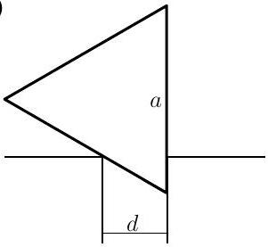
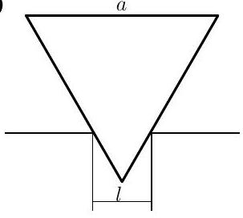

**1. PRIZMA (8 pont)**

i) (4 pont) Egy egyenlő oldalú háromszög alapú derékszögű prizmát egy vízszintes, két asztal közötti nyílásba helyezünk úgy, hogy az egyik oldallapja függőleges legyen. Mekkora lehet a nyílás $d$ szélessége maximálisan, mielőtt a prizma kiesne? A prizma és az asztalok között nincs súrlódás, a prizma homogén anyagból készült. A nyílás szélei párhuzamosak.

ii) (4 pont) Most úgy helyezzük el a prizmát a nyílásban, hogy az egyik oldallapja vízszintes legyen. Mekkora lehet a nyílás $l$ szélessége maximálisan, mielőtt az adott helyzet instabillá válna?

