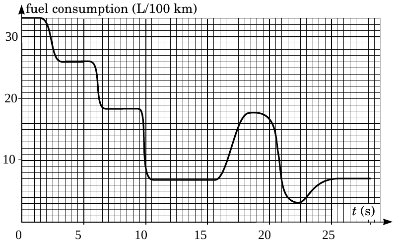

**1. ÜZEMANYAG-FOGYASZTÁS (5 pont)** — *Jaan Kalda.*

Az adott grafikon (a nagyobb méretű másolat külön lapon található) egy autó üzemanyag-fogyasztását mutatja az idő függvényében. Ismert, hogy az autó egy vízszintes út szakaszból indult el kezdeti gyorsulással $a_{0}=5 \mathrm{~m} / \mathrm{s}^{2}$. A $t_{1}=11 \mathrm{~s}$ időpontban az út vízszintes volt, és a sofőr bekapcsolta a tempomat-ot konstans sebességre $v_{0}=90 \mathrm{~km} / \mathrm{h}$. Röviddel ezt követően az autó elkezdte megmászni egy hegyoldalt. Milyen magas volt a hegyoldal legmagasabb pontja a $t_{1}$ időpontbeli magassághoz képest? Feltételezzük, hogy az autó hatásfoka minden időpontban konstans volt. Megjegyzés: a 2. és 10. másodperc között lehetnek emelkedések és/vagy süllyedések az úton.
