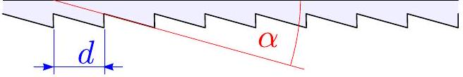
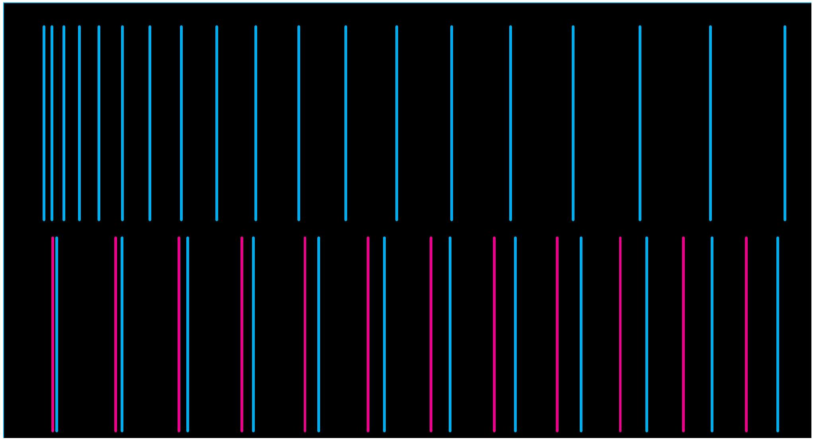

**4. FRESNEL-PRIZMA (12 pont)** — *Eero Uustalu és Jaan Kalda.*

**Eszközök:** Fresnel-prizmából készült lap, lila és magenta csíkokkal ellátott lap (lásd külön lapot), papirlap (képernyőként használható), vonalzó, mérőszalag, állvány, zöld lézer ($\lambda_{0} = 532\ \mathrm{nm}$). **FIGYELMEZTETÉS!** Kerüld a közvetlen vagy visszavert lézerfény nézegetését, az kár tehet a szemedon! A magenta csíkokból szóródott fény intenzitásmaximuma $\lambda_{m} = 630\ \mathrm{nm}$, a cián csíkokból pedig $\lambda_{c} = 495\ \mathrm{nm}$.

A Fresnel-prizma egy átlátszó lap, amelyen periodikus csíkok sora található; az ilyen lap keresztmetszete az ábrán látható. Az anyag törésmutatója, amelyből a lap készült, $n = 1{,}47$.

**i)** *(4 pont)* Határozd meg a Fresnel-prizma osztástávját, $d$-t (az ábra megmutatja az osztástáv definícióját).

**ii)** *(4 pont)* Határozd meg a prizma szögét, $\alpha$-t.

**iii)** *(4 pont)* Feltételezve, hogy a látható fény tartományában a Fresnel-prizma anyagának törésmutatója $n = n(\lambda)$ a hullámhossz lineáris függvénye, határozd meg a kromatikus diszperziót, $\frac{\mathrm{d}n}{\mathrm{d}\lambda}$-t.
