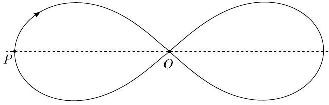

**1. GRAVITÁCIÓS VERSENY (11 pont)** — *Maté Vigh és Jaan Kalda.*

Habár általános esetben három gravitációsan kölcsönhatásban lévő test dinamikája bonyolult és kaotikus, vannak olyan speciális esetek, amikor a dinamika rendezett. Különösen vannak olyan esetek, amikor a testek periodikus mozgást végeznek. Az ilyen periodikus mozgás legegyszerűbb esete az, amikor mindhárom test egy egyenlő oldalú háromszög csúcsaiban helyezkedik el és merev testként forog. A következőkben egy összetettebb periodikus mozgást vizsgálunk.

Viszonylag közelmúltban fedezték fel, hogy három egyenlő pontszerű tömeg periodikusan mozoghat egy közös nyolcas alakú pályán, amely az ábrán látható (a nyíl a mozgás irányát jelöli). Ez az ábra számítógépes szimulációra alapul és helyes alakú. Szükség esetén az ábra nagyított változatáról (külön lapon) vonalzó segítségével mérheti meg a távolságokat.

Számozzuk meg a három testet 1, 2 és 3 számmal a sorrendjük szerint, ahogyan áthaladnak a bal szélső $P$ pont mellett az ábrán. Jelöljük $O_{2}$ és $O_{3}$ szimbólummal a 2. és 3. test helyzetét abban a pillanatban, amikor az 1. test áthalad a középső $O$ pont mellett. Hasonlóan, jelöljük $P_{2}$ és $P_{3}$ szimbólummal a 2. és 3. test helyzetét abban a pillanatban, amikor az 1. test áthalad a bal szélső $P$ pont mellett. Legyen $T$ az egyes testek teljes periódusideje az nyolcas alakú pályán.

**i)** *(2 pont)* Fejezd ki az alábbi utazási időket az egyik test esetén: (a) $O_{2}$-ből $O$-ba; (b) $O_{3}$-ból $P_{2}$-be.

**ii)** *(1 pont)* Legyen $\vec{v}_{1}, \vec{v}_{2}$ és $\vec{v}_{3}$ a három test sebessége egy adott pillanatban. Írj fel egy egyenlőséget, amely e három vektorokat kapcsolja össze.

**iii)** *(2 pont)* Igazold, hogy ennek a rendszernek a teljes impulzusmomentuma nulla.

**iv)** *(2 pont)* Szerkeszd meg az $O_{2}$ és $O_{3}$ pontok helyzetét (használd a külön lapon lévő ábrát). Indokold meg a szerkesztésed.

**v)** *(2 pont)* Szerkeszd meg a $P_{2}$ és $P_{3}$ pontok helyzetét (használd a külön lapon lévő ábrát). Találj két független szerkesztési módszert és indokold meg a módszereket.

**vi)** *(2 pont)* Határozd meg az $O$ pontban a testek sebességének és a $P$ pontban a sebességek arányát.
