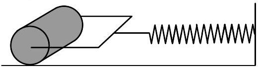

**2. HENGER (8 pont)** — *Lasse Frantti (iv, v: Jaan Kalda).*

A hengerek olyan szilárd homogén cilinder $M$ tömegből és $r$ sugarúból áll; vízszintes asztalon nyugszik, és a falhoz egy spirálrugó csatlakozik $k$ rugóállandóval (lásd az ábrát). A rugó tömege elhanyagolható, és ideális, azaz a Hooke-törvény tetszőlegesen nagy deformációk esetén is érvényes.

**i)** *(1 pont)* Először tegyük fel, hogy nincs súrlódás a henger és az asztal között. A hengert az oldalára tolják és elengedik; határozd meg az oszcillációk periódusát $T_{0}$.

**ii)** *(1 pont)* Mostantól kezdve a henger és az asztal közötti súrlódási tényezőt $\mu$ nem hanyagolhatjuk el. A hengert az oldalára tolják és előre-hátra gördül. Kis oszcillációs amplitúdó esetén nincs csúszás a henger és a felület között. Határozd meg az oszcillációk új periódusát $T_{r}$.

**iii)** *(2 pont)* Ha az kezdeti oszcillációs amplitúdó (a rugó deformációjaként mérve) nagyobb egy bizonyos kritikus $A_{\star}$ értéknél, az oszcillációk amplitúdója idővel csökken. Fejezd ki $A_{\boldsymbol{\star}}$ értéket $k$, $M$, $r$, a gravitációs gyorsulás $g$ és $\mu$ függvényében!

**iv)** *(2 pont)* Feltéve, hogy az kezdeti amplitúdó $A_{0}$ sokkal nagyobb, mint $A_{\star}$, mekkora a henger maximális szögsebessége a $0 \leq t \leq T / 2$ időintervallumban, ahol $t$ az elengedés óta eltelt idő?

**v)** *(2 pont)* Feltéve, hogy $A_{0} \gg A_{\star}$, rajzolj egy minőségi gráfot, amely az $\varepsilon r$ és $a$ időtől való függését mutatja; itt $\varepsilon$ és $a$ a henger szöggyorsulása és lineáris gyorsulása.
