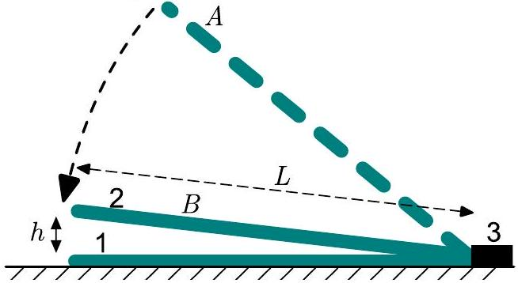
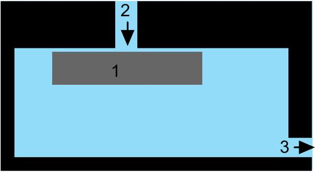

**2. GÁZ- ÉS FOLYADÉKÁRAMLÁS (10 pont)** — *Jaan Kalda, Päivo Simson.*

**i)** *(1 pont)* Ha üveglapot ejtünk egy másik üveglap tetejére, nem törik össze, hanem puha módon megáll. Az ábra egy olyan lapot mutat (az '1'-gyel jelölt), amely a földön pihen, és egy másikat (a '2'-vel jelölt), amely esik, miközben a talaj egyik dudora (a '3'-mal jelölt) megakadályozza a csúszást. Az eső lap az $A$ pozícióból indult, most a $B$ pozícióban van, nagyon kis $h = h_0$ távolságban az álló laptól, és jelenleg $\omega_0$ szögsebességgel esik. Mekkora a levegő sebessége a lapok között a baloldali szél közelében?

**ii)** *(2.5 pont)* Az üveglapnak $L \gg h_0$ szélessége, $t \ll L$ vastagsága és $\rho_g$ sűrűsége van, hossza az ábra mélysége irányában sokkal nagyobb, mint $L$. Hogyan függ az üvegföld szögsebessége a $h$-tól az azt követő mozgása során, ha a levegő sűrűsége $\rho_a$? Hanyagolja el a gravitációt, valamint a levegő viszkozitását és összenyomhatóságát. Feltételezzük, hogy a levegőáramlás mindenhol lamináris.

**iii)** *(3 pont)* Egy hengeres kőkorong (az ábrán az '1'-gyel jelölt) $R$ sugárral, $h$ vastagságával és $\rho_s$ sűrűségével egy $\rho_w$ sűrűségű vízzel feltöltött medence plafonjához van nyomva. A plafon felületén lévő kis dudorok egy kis $t \ll R$ távolságot tartanak meg a plafon és a korong felülete között. A víz egy csőből (a '2'-vel jelölt; a kifolyó cső '3' messze van) $r \ll R$ sugárral koaxiálisan a koronggal a medencébe áramlik, lásd az ábrát. A cső sugara sokkal nagyobb, mint a korong és a plafon közötti rés, azaz $r \gg t$. Mekkora legyen a $\mu \text{ (kg/s)}$ tömegárama a csőnek, hogy a korong ne essen le? A szabadesés gyorsulása $g$.

**iv)** *(0,5 pont)* A gőzturbinákat széles körben használják az erőművekben. Egy egyszerűsített modell szerint a vizet $t_t = 180°\text{C}$ hőmérsékleten és $p_t = 1 \times 10^6 \text{ Pa}$ nyomáson forraljuk (valós gőzturbinák sokkal magasabb nyomáson működhetnek), és a keletkezett gőz egy hengeres csatornán keresztül áramlik ki a fal $A = 1 \text{ cm}^2$ keresztmetszetű nyílásán; a környezeti nyomás $p_0 = 1 \times 10^5 \text{ Pa}$. Határozza meg az entrópia-különbséget $\Delta S$ egy mol gőz és egy mol folyékony víz között (moláris tömeg $M = 18 \text{ g/mol}$, gőzölgési hő 100°C-n: $L = 2,3 \text{ MJ/kg}$) a kiáramló sugárban.

**v)** *(3 pont)* Határozza meg a keletkezett gőzsugár tömegáramát $\mu$, valamint a benne lévő folyékony fázisú víz relatív tömegértékét $r$. Feltételezzük, hogy a csatornába és csatornában való áramlás során a gőz expanziója visszafordítható (azaz a hővezetés elhanyagolható, és a folyadék és gázfázis között mindig egyensúly van); a víz gőzének adiabatikus indexe $\gamma = 4/3$.
