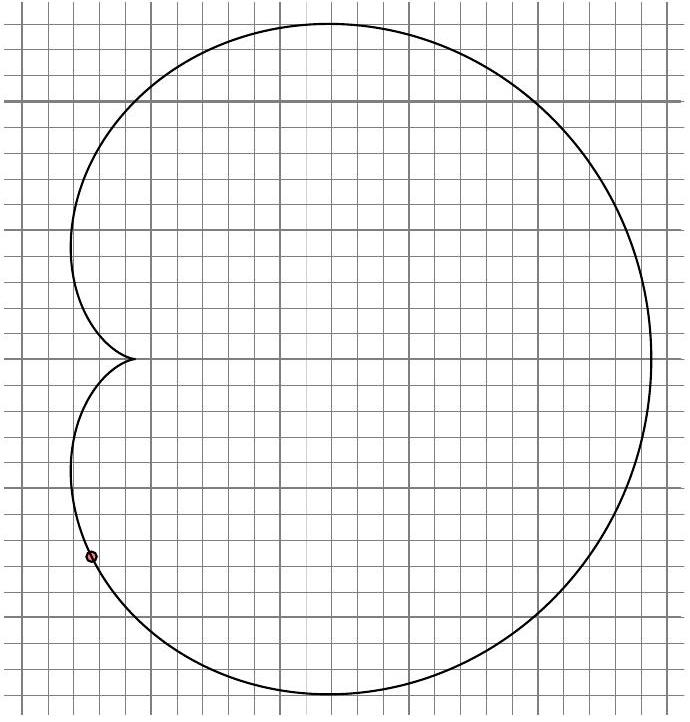
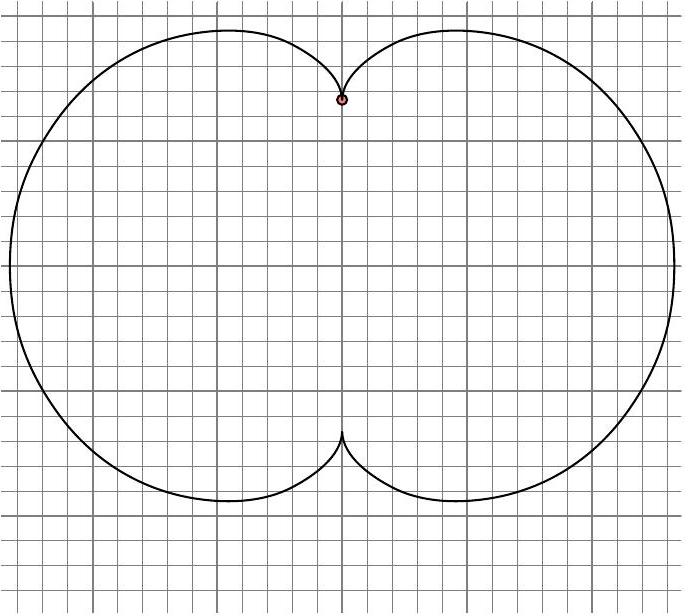

**7. ELEKTRONOK MÁGNESES TÉRBEN (9 pont)** — *Kaarel Hänni, Jaan Kalda.*

A továbbiakban két elektront ($m$ tömegű, $-e$ töltésű) vizsgálunk, amelyek $B$
indukciójú homogén mágneses térben úgy mozognak, hogy a két elektron közötti távolság
mindvégig állandó marad; a különböző részfeladatok különböző eseteket vizsgálnak.

**i)** *(2 pont)* Az elektronok közötti távolság olyan nagy, hogy elektrosztatikus
taszításuk elhanyagolható. Egy adott pillanatban az elektronok sebességvektorai közötti
szög $\alpha \neq 0$, és egyikük a másik irányába mozog $v$ sebességgel. Rajzold fel
mindkét elektron pályáját! Mekkora a másik elektron sebessége?

**ii)** *(1 pont)* Az elektrosztatikus taszítást továbbra is elhanyagoljuk. Most a két
elektron pályája metszi egymást, és egy adott pillanatban az egyikük sebessége
$\vec{v}$. Mit mondhatunk a másik elektron sebességéről ugyanabban a pillanatban?
Rajzold fel mindkét pályát!

**iii)** *(2 pont)* Mekkora az elektronok közötti $l$ távolság, ha mindkettő
$\frac{6\pi m}{Be}$ periódusú periodikus mozgást végez, miközben állandó sebességgel
mozog?

**iv)** *(2 pont)* Az alábbi ábra az egyik elektron pályáját mutatja egy bizonyos
kezdőfeltétel-halmaz esetén. Hol van a másik elektron abban a pillanatban, amikor az
első elektron a kis kör helyzetében van? Mekkora ennek a mozgásnak a periódusa?

**v)** *(2 pont)* Az alábbi ábra az egyik elektron pályáját mutatja egy bizonyos
kezdőfeltétel-halmaz esetén. Mekkora a másik elektron sebessége abban a pillanatban,
amikor az első elektron a kis kör helyzetében van?

