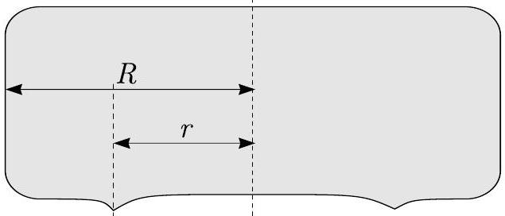

**1. Curling (8 pont)** — *Oskar Vallhagen.*

A curlingben a résztvevők felváltva csúsztatnak közel hengeres köveket egy jég pályán egy cél felé, megpróbálva a köveket a lehető közelebb juttani a célhoz. A kő függőleges keresztmetszete az alábbiakban látható, amely azt mutatja, hogy a kő az ággal egy vékony $r$ sugarú körön érintkezik. A kő teljes sugara $R$, a tömege $m$ és a jéggel való súrlódási együtthatója $\mu$.

Tekintsük azt az esetet, amikor a kő $v_{0}$ sebességgel indul, célja pedig egy ellenfél kövét leütni $s$ távolságban.

**i)** *(1 pont)* Adjon kifejezést a csúszási sebességre $v_{s}$ az idő $t$ függvényeként a kő felszabadulása és az ellenfél kövének elérése között.

**ii)** *(1 pont)* Mekkora a csúszási sebesség $v_{\text{hit}}$ közvetlenül az ellenfél kövének elérése előtt?

Most a kő kap egy kis forgást kezdeti szögsebességgel $\omega_{0}$ (ezt megtehetik a kő eltérítési szögének megváltoztatására az ütközés alkalmával). Feltételezzük, hogy a forgási sebesség $\omega$ végig kicsi marad: $\omega r \ll v_{s}$. Tartsa meg csak a fő nem eltűnő tagokat a számításoknál, azaz az $\left(\omega r / v_{s}\right)^{n}$ faktorral rendelkező tagok között csak a legkisebb $n$-ű tagot. Az alábbi közelítéseket használhatja $x \ll 1$ esetén: $(1+x)^{\alpha} \approx 1+\alpha x+\frac{1}{2} \alpha(\alpha-1) x^{2}$, $\sin(\alpha+x) \approx \sin \alpha+x \cos \alpha$, $\cos x \approx 1-x^{2} / 2$. Szükség lehet az integrálra: $\int(a t+b)^{-1} d t=a^{-1} \ln \mid a t+b \mid+C$.

**iii)** *(2 pont)* Mennyivel változik meg a kőre ható súrlódási erő a forgása miatt? Adja meg válaszát az aktuális szögsebesség $\omega$ és a csúszási sebesség $v_{s}$ függvényében.

**iv)** *(2 pont)* Adjon kifejezést a kőre ható forgatónyomatékra $T$.

**v)** *(2 pont)* Mekkora a kő szögsebessége közvetlenül az ellenfél kövének elérése előtt?
