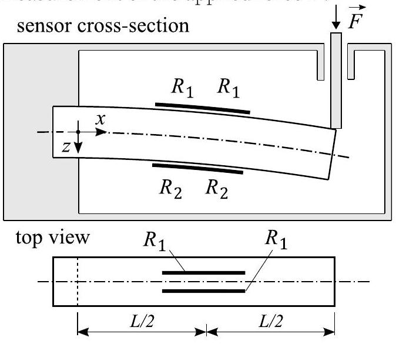
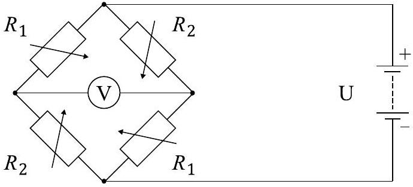

**5. Erősegmérő (5 pont)** — *Päivo Simson.*

Az erőmérő egy rugalmas gerendából készül, amely $L$ hosszúságú munkaterülettel és $h$ magassággal rendelkezik, és amely négy azonos elektromos ellenállású $l \ll L$ hosszúságú vezetékből épül fel, ahogy az alábbi ábrán látható. Amikor az erő $F$ kifejtődik a gerenda végén, hajlítja a gerendát és nyújtja az felső vezetékeket és tömöríti az alsóakat, amely az elektromos ellenállás megváltozásához vezet. A Wheatstone híd módszerét alkalmazva ezek a változások voltmérő-leolvasássá alakíthatók, amely az erő $F$ méréseit teszi lehetővé.

A következőkben feltételezzük, hogy a gerenda eltérése nagyon kicsi.

**i)** *(2 pont)* A hajlítónyomaték $M(x)$ (vagyis az a forgatónyomaték, amellyel a gerenda egyik fiktív fele a másikra hat) fordítottan arányos a gerenda középvonalának görbületi sugarával $r(x)$: $M=E I / r$, ahol $E$ a Young-módulus és $I$ a gerenda keresztmetszetének geometriájától függő állandó (mindkettő ismert). Határozza meg az felső vezeték nyúlását $\Delta l$, amikor az erő $F$ az érzékelőre hat. Feltételezzük, hogy a vezetékek a gerenda középpontjában helyezkednek el.

**ii)** *(1 pont)* Határozza meg az ellenállásokat $R_{1}$ és $R_{2}$, amikor az előző rész $\Delta l$ értéke ismert, és a vezetékek kezdeti ellenállása $R_{0}$. Feltételezzük, hogy a vezeték térfogata az alakváltozás alatt állandó marad.

**iii)** *(2 pont)* Az ellenállások az alábbi ábrán látható Wheatstone híd konfigurációban vannak elrendezve, ahol $U$ az ismert akkumulátor feszültsége. Határozza meg a mért feszültség $V$ és az erő $F$ közötti kapcsolatot.

