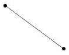

**9. Háromszög (5 pont)** — *Jaan Kalda.*

Három azonos kis vasgolyó kezdetben egy egyenlő oldalú háromszög alakzatban helyezkedik el, tömeg nélküli, nyújthatatlan szálakkal összekötve. Az levegőbe dobott rendszer az alábbi feltételeknek volt alávetve: (a) az összes szál kezdetben feszes volt; (b) az összes golyónak különböző sebességei voltak; (c) az összes sebesség a háromszög síkjában volt, miközben a rendszer szabadesésben volt a Föld gravitációs terében. Egy bizonyos $t=0$ időpontban két szál elszakadt, egy szál maradt, amely két golyót összeköt, míg a harmadik golyó elszigetelődött a többi golyótól. A mellékelt ábra mutatja az összes három golyó helyzetét és a megmaradt szálat az eredeti elrendezésükben egy későbbi $t=T$ időpontban, amikor az összes golyó továbbra is szabadesésben volt.

**i)** *(4 pont)* Hány fokkal fordult el a megmaradt szál a $t=0$ és $t=T$ közötti időszakban?

**ii)** *(1 pont)* Az elfordulás az óramutató járása szerinti vagy azzal ellentétes volt?
