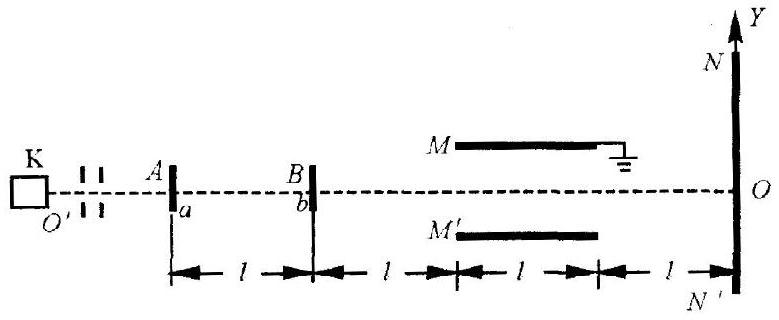
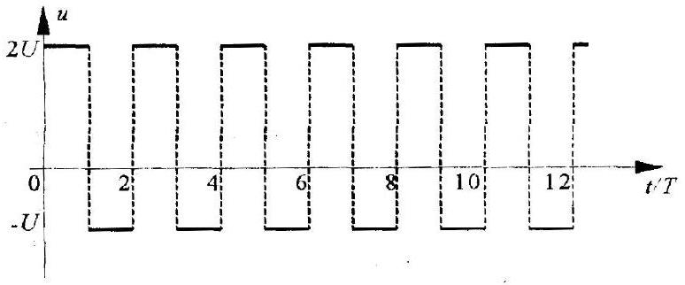

四、图1 中 K 为带电粒子发射源，从中可持续不断地射出质量、电荷都相同的带正电的粒子流，它们的速度方向都沿图中虚线 00，速度的大小具有一切可能值但都是有限的。当粒子打在垂直于00的屏 $\mathrm{NN}^{\prime}$ 上时，会在屏上留下永久性的痕迹。屏内有一与虚线垂直的坐标轴 Y，其原点位于屏与虚线的交点 0 处，Y 的正方向由 0 指向 N．虚线上的 A、B 两处，各有一电子阀门 a 和 b．阀门可以根据指令开启或关闭。开始时两阀门都处于关闭状态，挡住粒子流，M、$\mathrm{M}^{\prime}$ 是两块较大的平行金属平板，到虚线 00 的距离都是 d，板 M 接地。在两板间加上如图2所示的周期为2T的交变电压 u，u 的正向最大值为2U，负向最大值为 U．已知当带电粒子处在两平板间的空间时，若两平板间的电压为 $U$ ，则粒子在电场作用下的加速度 a 、电压 u 的半周期 T 和平板到虚线的距离d 满足以下关系

$$
\mathrm{aT}^{2}=\frac{1}{5} \mathrm{~d}
$$

已知 AB 间的距离、B 到金属板左端的距离、金属板的长中国科学技术，

图1

图2

## 中国科学技术大学物理学院叶邦角整理

度以及金属板右端到屏的距离都是 $l$ ．不计重力的作用．不计带电粒子间的相互作用。打在阀门上的粒子被阀门吸收，不会影响以后带电粒子的运动。只考虑MM 之间的电场并把它视为匀强电场。
1．假定阀门从开启到关闭经历的时间 $\delta$ 比 T 小得多，可忽略不计。现在某时刻突然开启阀门 a 又立即关闭；经过时间 T，再次开启阀门 a 又立即关闭；再经过时间 T，第 3 次开启阀门 a 同时开启阀门 b ，立即同时关闭 a 、b．若以开启阀门 b 的时刻作为图2 中 $\mathrm{t}=0$ 的时刻，则屏上可能出现的粒子痕迹的 Y 坐标（只要写出结果，不必写出计算过程）为 $\_\_\_\_$
$\_\_\_\_$。
2．假定阀门从开启到关闭经历的时间 $\delta=\frac{T}{10}$ ，现在某时刻突然开启阀门 a ，经过时间 $\delta$ 立即关闭 a ；从刚开启 a 的时刻起，经过时间 T ，突然开启阀门 b ，经过时间 $\delta$ 关闭 b 。若以刚开启阀门 b 的时刻作为图 2 中 $\mathrm{t}=0$ 的时刻，则从B 处射出的具有最大速率的粒子射到屏上所产生的痕迹的 Y 坐标（只要写出结果，不必写出计算过程）为 $\_\_\_\_$。

具有最小速率的粒子射到屏上所产生的痕迹的坐标（只要写出结果，不必写出计算过程）为 $\_\_\_\_$。
