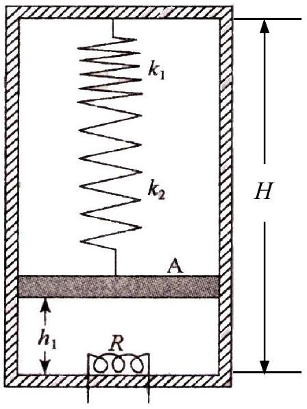

## 三、

如图所示，在一个坚直放置的封闭的高为 $H$ 、内壁横截面积为 $S$ 的绝热气缸内，有一质量为 $m$ 的绝热活塞 $A$ 把缸内分成上、下两部分。活塞可在缸内贴缸壁无摩擦地上下滑动。缸内顶部与 $A$ 之间串联着两个劲度系数分别为 $k_{1}$ 和 $k_{2}\left(k_{1} \neq k_{2}\right)$ 的轻质弹簧。 $A$ 的上方为真空；
$A$ 的下方盛有一定质量的理想气体。已知系统处于平衡状态，$A$ 所在处的高度（其下表面与缸内底部的距离）与两弹簧总共的压缩量相等皆为 $h_{1}=H / 4$ 。现给电炉丝$R$ 通电流对气体加热，使 $A$ 从高度 $h_{1}$ 开始上升，停止加热后系统达到平衡时活塞的高度为 $h_{2}=3 H / 4$ 。求此过程中气体吸收的热量 $\triangle Q$ ．已知当体积不变时，每摩尔该气体温度每升高 1 K 吸收的热量为 $3 R / 2, R$ 为普适气体恒量。在整个过程中假设弹簧始终遵从胡克定律。

