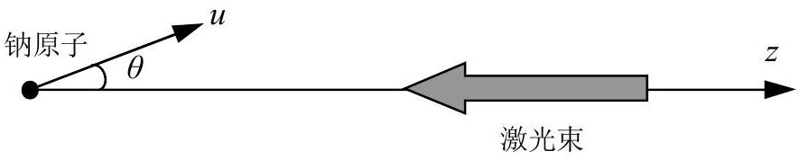
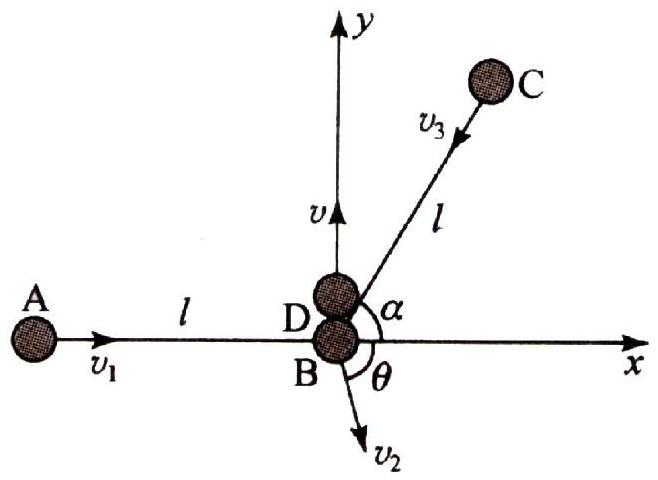
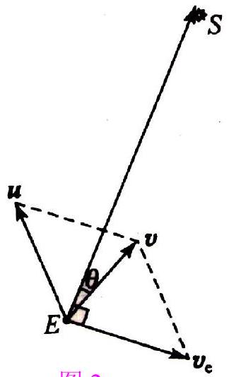
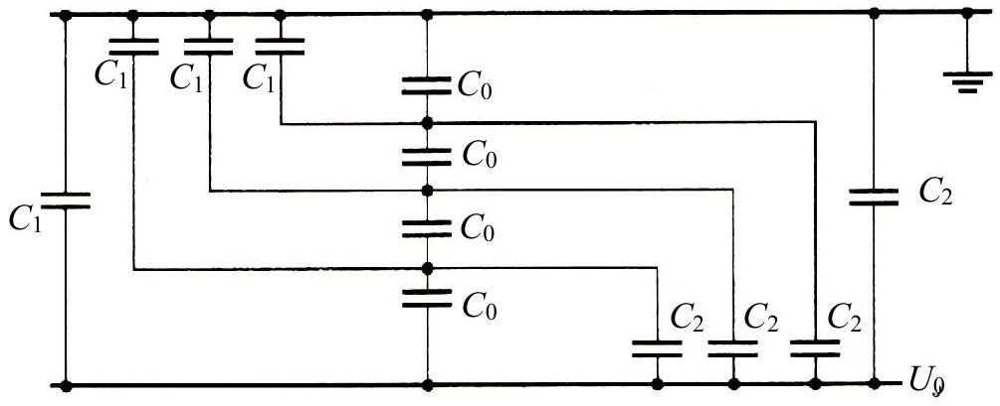
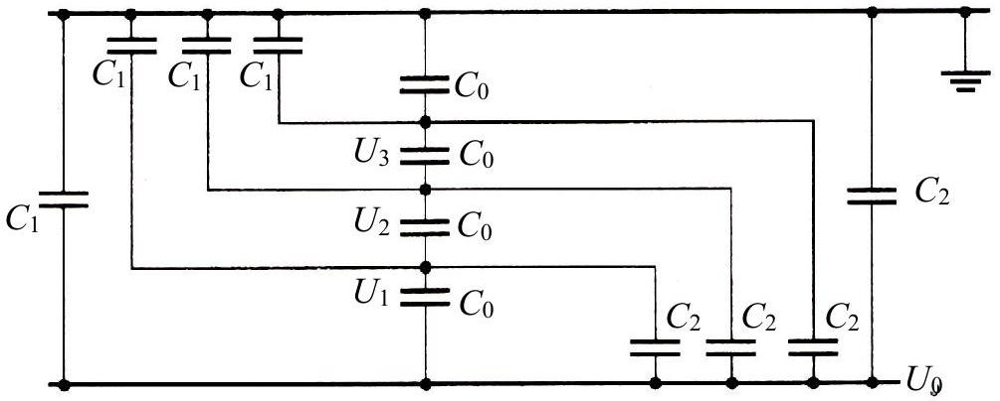

## 七、

已知钠原子从激发态（记做 $\mathrm{P}_{3 / 2}$ ）跃迁到基态（记做 $\mathrm{S}_{1 / 2}$ ）所发出的光谱线波长 $\lambda_{0} =588.9965 \mathrm{~nm}$ ．现有一团钠原子气，其中的钠原子做无规的热运动（钠原子的运动不必考虑相对论效应），被一束沿 $z$ 轴负方向传播的波长为 $\lambda=589.0080 \mathrm{~nm}$ 的激光照射。以 $\theta$ 表示钠原子运动方向与 $z$ 轴正方向之间的夹角（如图所示）。问在 $30^{\circ}<\theta<45^{\circ}$ 角度区间内的钠原子中速率 $u$ 在什么范围内能产生共振吸收，从 $\mathrm{S}_{1 / 2}$ 态激发到 $\mathrm{P}_{3 / 2}$ 态？并求共振吸收前后钠原子速度（矢量）变化的大小。已知钠原子质量为 $M=3.79 \times 10^{-26} \mathrm{~kg}$ ，普朗克常量 $h=6.626069 \times 10^{-34} \mathrm{~J} \cdot \mathrm{~s}$ ，真空中的光速 $c=2.997925 \times 10^{8} \mathrm{~m} \cdot \mathrm{~s}^{-1}$ 。

## 第24届全国中学生物理竞赛决赛参考解答

一、
1．分析刚碰后各球速度的方向．由于 $D$ 与 $B$ 球发生弹性正碰，所以碰后 $D$ 球的速度方向仍在 $y$ 轴上；设其方向沿 $y$ 轴正方向，大小为 $v$ ．由于线不可伸长，所以在 $D, B$两球相碰的过程中，$A, C$ 两球都将受到线给它们的冲量；又由于线是柔软的，线对 $A$ ，C 两球均无垂直于线方向的作用力，因此刚碰后，$A$ 球的速度沿 $A B$ 方向，$C$ 球的速度沿$C B$ 方向．用 $\theta$ 表示 $B$ 球的速度方向与 $x$ 轴的

夹角，则各球速度方向将如图所示．因为此时连接 $A, B, C$ 三球的两根线立即断了，所以此后各球将做匀速直线运动。

2．研究碰撞后各球速度的大小．以 $v_{1}$ ，$v_{2}$ ，$v_{3}$ 分别表示刚碰后 $A, B$ ，$C$ 三球速度的大小，如图所示．因为碰撞过程中动量守恒，所以沿 $x$ 方向有

$$
m v_{1}-m v_{3} \cos \alpha+m v_{2} \cos \theta=0 \quad ;
$$

沿 $y$ 方向有

$$
-m v_{0}=m v-m v_{2} \sin \theta-m v_{3} \sin \alpha .
$$

根据能量守恒有

$$
\frac{1}{2} m v_{0}^{2}=\frac{1}{2} m v_{1}^{2}+\frac{1}{2} m v_{2}^{2}+\frac{1}{2} m v_{3}^{2}+\frac{1}{2} m v^{2} .
$$

因为碰撞过程中线不可伸长，$B$ ，$C$ 两球沿 $B C$ 方向的速度分量相等，$A, B$ 两球沿$A B$ 方向的速度分量相等，有

$$
\begin{aligned}
& v_{2} \cos \theta=v_{1} \\
& v_{2} \cos [\pi-(\alpha+\theta)]=v_{3} .
\end{aligned}
$$

将 $\alpha=\pi / 3$ 代入，由以上各式可解得

$$
\begin{aligned}
& v_{1}=\frac{\sqrt{3}}{12} v_{0}, \\
& v_{2}=\frac{\sqrt{21}}{6} v_{0}, \\
& v_{3}=\frac{\sqrt{3}}{3} v_{0},
\end{aligned}
$$

$$
v=\frac{1}{4} v_{0} .
$$

3．确定刚碰完后，$A, B, C$ 三球组成的系统质心的位置和速度。由于碰撞时间极短，刚碰后 $A$ ，$B$ ，$C$ 三球组成的系统，其质心位置就是碰撞前质心的位置，以（ $x_{\mathrm{c}}, y_{\mathrm{c}}$ ）表示此时质心的坐标，根据质心的定义，有

$$
\begin{aligned}
& x_{\mathrm{c}}=\frac{m l \cos \alpha-m l}{3 m}, \\
& y_{\mathrm{c}}=\frac{m l \sin \alpha}{3 m} .
\end{aligned}
$$

代入数据，得

$$
\begin{aligned}
& x_{\mathrm{c}}=-\frac{1}{6} l, \\
& y_{\mathrm{c}}=\frac{\sqrt{3}}{6} l .
\end{aligned}
$$

根据质心速度的定义，可求得碰后质心速度 $v_{\mathrm{c}}$ 的分量为

$$
\begin{aligned}
& v_{\mathrm{c} x}=\frac{m v_{1}+m v_{2} \cos \theta-m v_{3} \cos \alpha}{3 m}, \\
& v_{\mathrm{c} y}=\frac{-m v_{2} \sin \theta-m v_{3} \sin \alpha}{3 m} .
\end{aligned}
$$

由（4）～（7）和（14），（15）各式及 $\alpha$ 值可得

$$
\begin{aligned}
v_{\mathrm{c} x} & =0, \\
v_{\mathrm{c} y} & =-\frac{5}{12} v_{0} .
\end{aligned}
$$

4．讨论碰后 $A, B, C$ 三球组成的系统的质心和 $D$ 球的运动。刚碰后 $A, B, C$ 三球组成的系统的质心将从坐标（ $x_{\mathrm{c}}=-l / 6, y_{\mathrm{c}}=\sqrt{3} l / 6$ ）处出发，沿 $y$ 轴负方向以大小为 $5 v_{0} / 12$ 的速度做匀速直线运动；而 $D$ 球则从坐标原点 $O$ 出发，沿 $y$ 轴正方向以大小为$v_{0} / 4$ 的速度做匀速直线运动。 $A$ ，$B$ ，$C$ 三球组成系统的质心与 $D$ 球是平行反向运动，只要 $D$ 球与 $C$ 球不发生碰撞，则 $v_{\mathrm{C}}, v_{\mathrm{D}}$ 不变，质心与 $D$ 球之间的距离逐渐减少．到 $y$ 坐标相同处时，它们相距最近．用 $t$ 表示所求的时间，则有

$$
v t=y_{\mathrm{c}}+v_{\mathrm{c} y} t
$$

将 $v_{\mathrm{c} y}, v, y_{\mathrm{c}}$ 的值代入，得

$$
t=\frac{\sqrt{3} l}{4 v_{0}} .
$$

此时，$D$ 球与 $A, B, C$ 三球组成系统的质心两者相距 $l / 6$ ．在求出（19）式的过程中，假设了在 $t=\sqrt{3} l / 4 v_{0}$ 时间内 $C$ 球未与 $D$ 球发生碰撞．下面说明此假设是正确的；因为 $v_{3}=\sqrt{3} v_{0} / 3$ ，它在 $x$ 方向分量的大小为 $\sqrt{3} v_{0} / 6$ 。经过 $t$ 时间，它沿 $x$ 轴负方向经

过的距离为 $l / 8$ 。而 $C$ 球的起始位置的 $x$ 坐标为 $l / 2$ 。经 $t$ 时间后，$C$ 球尚未到达 $y$ 轴，不会与 $D$ 球相碰．

## 二、

从地球表面发射宇宙飞船时，必须给飞船以足够大的动能，使它在克服地球引力作用后，仍具有合适的速度进入绕太阳运行的椭圆轨道．此时，飞船离地球已足够远，但到太阳的距离可视为不变，仍为日地距离。飞船在地球绕太阳运动的轨道上进入它的椭圆轨道，用 $E$表示两轨道的交点，如图1所示。图中半径为$r_{\mathrm{se}}$ 的圆 $A$ 是地球绕太阳运行的轨道，太阳 $S$ 位于圆心．设椭圆 $B$ 是飞船绕日运行的轨道，$P$ 为椭圆轨道的近日点．

由于飞船绕日运行的周期与地球绕日运行的周期相等，根据开普勒第三定律，椭圆的半长轴 $a$ 应与日地距离 $r_{\mathrm{se}}$ 相等，即有

$$
a=r_{\mathrm{se}}
$$

根据椭圆的性质，轨道上任一点到椭圆两焦点的距离之和为 $2 a$ ，由此可以断定，两轨道的交点 $E$ 必为椭圆短轴的一个顶点，$E$ 与椭圆长轴和短轴的交点 $Q$（即椭圆的中心）的连线垂直于椭圆的长轴。由 $\triangle E S Q$ ，可以求出半短轴

$$
b=\sqrt{r_{\mathrm{se}}^{2}-(a-\overline{S P})^{2}} .
$$

由（1），（2）两式，并将 $a=r_{\mathrm{se}}=1 \mathrm{AU}, \overline{S P}=0.01 \mathrm{AU}$ 代入，得

$$
b=0.141 \mathrm{AU} .
$$

在飞船以椭圆轨道绕太阳运行过程中，若以太阳为参考系，飞船的角动量和机械能是守恒的。设飞船在 $E$ 点的速度为 $v$ ，在近日点的速度为 $v_{\mathrm{p}}$ ，飞船的质量为 $m$ ，太阳的质量为$M_{\mathrm{s}}$ ，则有

$$
m v a \sin \theta=m v_{\mathrm{p}} \overline{S P},
$$

式中 $\theta$ 为速度 $v$ 的方向与 $E, S$ 两点连线间的夹角：

$$
\sin \theta=\frac{b}{a} .
$$

由机械能守恒，得

$$
\frac{1}{2} m v^{2}-G \frac{M_{\mathrm{s}} m}{a}=\frac{1}{2} m v_{\mathrm{p}}^{2}-\frac{G m M_{\mathrm{s}}}{\overline{S P}}
$$

因地球绕太阳运行的周期 $T$ 是已知的 $(T=365 \mathrm{~d})$ ，若地球的质量为 $M_{\mathrm{e}}$ ，则有

$$
G \frac{M_{\mathrm{s}} M_{\mathrm{e}}}{a^{2}}=M_{\mathrm{e}}\left(\frac{2 \pi}{T}\right)^{2} a .
$$

解（3）～（7）式，并代入有关数据，得

$$
v=29.8 \mathrm{~km} / \mathrm{s} .
$$

（8）式给出的 $v$ 是飞船在 $E$ 点相对于太阳的速度的大小，即飞船在克服地球引力作用后从$E$ 点进入椭圆轨道时所必须具有的相对于太阳的速度。若在 $E$ 点飞船相对地球的速度为 $u$ ，因地球相对于太阳的公转速度为

$$
v_{\mathrm{e}}=\frac{2 \pi a}{T}=29.8 \mathrm{~km} / \mathrm{s},
$$

方向如图1所示。由速度合成公式，可知

$$
v=u+v_{\mathrm{e}},
$$

速度合成的矢量图如图2所示，注意到 $v_{\mathrm{e}}$ 与 $\overline{E S}$ 垂直，有

图2

$$
u=\sqrt{v^{2}+v_{\mathrm{e}}^{2}-2 v v_{\mathrm{e}} \cos \left(\frac{\pi}{2}-\theta\right)},
$$

代入数据，得

$$
u=39.1 \mathrm{~km} / \mathrm{s} .
$$

$u$ 是飞船在 $E$ 点相对于地球的速度，但不是所要求的发射速度 $u_{0}$ 。为了求得 $u_{0}$ ，可以从与地心固定连接在一起的参考系来考察飞船的运动。因飞船相对于地球的发射速度为 $u_{0}$ 时，飞船离地心的距离等于地球半径 $R_{\mathrm{e}}$ 。当飞船相对于地球的速度为 $u$ 时，地球引力作用可以忽略。由能量守恒，有

$$
\frac{1}{2} m u_{0}^{2}-G \frac{M_{\mathrm{e}} m}{R_{\mathrm{e}}}=\frac{1}{2} m u^{2}
$$

地面处的重力加速度为

$$
g=G \frac{M_{\mathrm{e}}}{R_{\mathrm{e}}^{2}}
$$

解（13），（14）两式，得

$$
u_{0}=\sqrt{u^{2}+2 g R_{\mathrm{e}}} .
$$

由（15）式及有关数据，得

$$
u_{0}=40.7 \mathrm{~km} / \mathrm{s} .
$$

如果飞船在 $E$ 点处以与图示相反的方向进入椭圆轨道，则（11）式要做相应的改变。此时，它应为

$$
u=\sqrt{v^{2}+v_{\mathrm{e}}^{2}-2 v v_{\mathrm{e}} \cos \left(\frac{\pi}{2}+\theta\right)},
$$

相应计算，可得另一解

$$
u=45.0 \mathrm{~km} / \mathrm{s}, \quad u_{0}=46.4 \mathrm{~km} / \mathrm{s} .
$$

如果飞船进入椭圆轨道的地点改在 $E$ 点的对称点处（即地球绕日轨道与飞船绕日轨道的另一个交点上），则计算过程相同，结果不变．

## 三、

两个弹簧串联时，作为一个弹簧来看，其劲度系数

$$
k=\frac{k_{1} k_{2}}{k_{1}+k_{2}} .
$$

设活塞 $A$ 下面有 $v \mathrm{~mol}$ 气体．当 $A$ 的高度为 $h_{1}$ 时，气体的压强为 $p_{1}$ ，温度为 $T_{1}$ 。由理想气体状态方程和平衡条件，可知

$$
\begin{aligned}
& p_{1} S h_{1}=v R T_{1} \\
& p_{1} S=k h_{1}+m g
\end{aligned}
$$

对气体加热后，当 $A$ 的高度为 $h_{2}$ 时，设气体压强为 $p_{2}$ ，温度为 $T_{2}$ ．由理想气体状态方程和平衡条件，可知

$$
\begin{aligned}
& p_{2} S h_{2}=v R T_{2} \\
& p_{2} S=k h_{2}+m g
\end{aligned}
$$

在 $A$ 从高度 $h_{1}$ 上升到 $h_{2}$ 的过程中，气体内能的增量

$$
\triangle U=v \frac{3}{2} R\left(T_{2}-T_{1}\right) .
$$

气体对弹簧、活塞系统做的功 $W$ 等于弹簧弹性势能的增加和活塞重力势能的增加，即

$$
W=\frac{1}{2} k\left(h_{2}^{2}-h_{1}^{2}\right)+m g\left(h_{2}-h_{1}\right) .
$$

根据热力学第一定律，有

$$
\triangle Q=\triangle U+W .
$$

由以上各式及已知数据可求得

$$
\Delta Q=\frac{k_{1} k_{2}}{k_{1}+k_{2}} H^{2}+\frac{5}{4} m g H .
$$

四、
1．根据题意，当导体球与导体球壳间的电压为 $U$ 时，在距球心 $r\left(R_{1}<r<R_{2}\right)$ 处，电场强度的大小为

$$
E=\frac{R_{1} R_{2}}{R_{2}-R_{1}} \frac{U}{r^{2}} .
$$

在 $r=R_{1}$ ，即导体球表面处，电场强度最大．以 $E\left(R_{1}\right)$ 表示此场强，有

$$
E\left(R_{1}\right)=\frac{R_{2} U}{\left(R_{2}-R_{1}\right) R_{1}} .
$$

因为根据题意，$E\left(R_{1}\right)$ 的最大值不得超过 $E_{\mathrm{k}}, R_{2}$ 为已知，故（2）式可写为

$$
E_{\mathrm{k}}=\frac{R_{2} U}{\left(R_{2}-R_{1}\right) R_{1}}
$$

或

$$
U=E_{\mathrm{k}} \frac{\left(R_{2}-R_{1}\right) R_{1}}{R_{2}} .
$$

由此可知，选择适当的 $R_{1}$ 值，使 $\left(R_{2}-R_{1}\right) R_{1}$ 最大，就可使绝缘子的耐压 $U$ 为最大．不难看出，当

$$
R_{1}=\frac{R_{2}}{2}
$$

时，$U$ 便是绝缘子能承受的电压的最大值 $U_{\mathrm{k}}$ ．由（4），（5）两式得

$$
U_{\mathrm{k}}=\frac{E_{\mathrm{k}} R_{2}}{4},
$$

代入有关数据，得

$$
U_{\mathrm{k}}=155 \mathrm{kV} .
$$

当交流电压的峰值等于 $U_{\mathrm{k}}$ 时，绝缘介质即被击穿。这时，对应的交流电压的有效值

$$
U_{\mathrm{e}}=\frac{U_{\mathrm{k}}}{\sqrt{2}} 110 \mathrm{kV} .
$$

2．系统的等效电路如图所示。

3．设绝缘子串中间三点的电势分别为 $U_{1}, U_{2}, U_{3}$ ，如图所示．由等效电路可知，与每个中间点相连的四块电容极板上的电荷量代数和都应为零，即有

$$
\left\{\begin{array}{l}
\left(U_{1}-U_{2}\right) C_{0}+U_{1} C_{1}-\left(U_{0}-U_{1}\right) C_{0}-\left(U_{0}-U_{1}\right) C_{2}=0, \\
\left(U_{2}-U_{3}\right) C_{0}+U_{2} C_{1}-\left(U_{1}-U_{2}\right) C_{0}-\left(U_{0}-U_{2}\right) C_{2}=0, \\
U_{3} C_{0}+U_{3} C_{1}-\left(U_{2}-U_{3}\right) C_{0}-\left(U_{0}-U_{3}\right) C_{2}=0 .
\end{array}\right.
$$

四个绝缘子上的电压之和应等于 $U_{0}$ ，即

$$
\left(U_{0}-U_{1}\right)+\left(U_{1}-U_{2}\right)+\left(U_{2}-U_{3}\right)+U_{3}=U_{0} .
$$

设

$$
\triangle U_{1}=U_{0}-U_{1}, \quad \triangle U_{2}=U_{1}-U_{2}, \quad \triangle U_{3}=U_{2}-U_{3}, \quad \triangle U_{4}=U_{3},
$$

则可由（9）式整理得

$$
\left\{\begin{array}{l}
\triangle U_{1}\left(C_{0}+C_{1}+C_{2}\right)-\triangle U_{2} C_{0}-U_{0} C_{1}=0, \\
\triangle U_{1}\left(C_{1}+C_{2}\right)+\triangle U_{2}\left(C_{0}+C_{1}+C_{2}\right)-\triangle U_{3} C_{0}-U_{0} C_{1}=0, \\
\triangle U_{1}\left(C_{0}+C_{1}+C_{2}\right)+\triangle U_{2}\left(C_{0}+C_{1}+C_{2}\right)+\triangle U_{3}\left(2 C_{0}+C_{1}+C_{2}\right)-U_{0}\left(C_{0}+C_{1}\right)=0 ;
\end{array}\right.
$$

代入数据，得

$$
\left\{\begin{array}{l}
76 \triangle U_{1}-70 \triangle U_{2}-5 U_{0}=0, \\
6 \triangle U_{1}+76 \triangle U_{2}-70 \triangle U_{3}-5 U_{0}=0, \\
76 \triangle U_{1}+76 \triangle U_{2}+146 \triangle U_{3}-75 U_{0}=0 .
\end{array}\right.
$$

解（12）式，可得

$$
\triangle U_{1}=0.298 U_{0}, \quad \triangle U_{2}=0.252 U_{0}, \quad \triangle U_{3}=0.228 U_{0} .
$$

由（10）～（12）式可得

$$
\triangle U_{4}=U_{3}=0.222 U_{0} .
$$

以上结果表明，各个绝缘子承受的电压不是均匀的；最靠近输电线的绝缘子承受的电压最大，此绝缘子最容易被击穿。当最靠近输电线的绝缘子承受的电压有效值

$$
\triangle U_{1}=U_{\mathrm{e}}
$$

时，此绝缘子被击穿，整个绝缘子串损坏。由（8），（13）和（15）三式可知，绝缘子串承受的最大电压

$$
U_{0 \max }=\frac{U_{\mathrm{e}}}{0.298}=369 \mathrm{kV} .
$$

五、
1．如图所示，位于坐标 $y$ 处的带电粒子 $P$ 受到库仑力 $F_{E}$ 为斥力，其 $y$ 分量为

$$
F_{E y}=k \frac{Q q}{r^{2}} \sin \theta=k \frac{Q q y}{\left(d^{2}+y^{2}\right)^{3 / 2}},
$$

式中 $r$ 为 $P$ 到 $A$ 的距离，$\theta$ 为 $r$ 与 $x$ 轴的夹角。可以看出，$F_{E y}$ 与 $y$ 有关：当 $y$ 较小时，（1）式分子中的 $y$ 起主要作用，$F_{E y}$ 随 $y$ 的增大而增大；当 $y$ 较大时，（1）式分母中的 $y$ 起主要作用，$F_{E y}$ 随 $y$ 的增大而减小。可见，$F_{E y}$ 在随 $y$ 由小变大的过程中会出现一个极大值。通过数值计算法，可求得 $F_{E y}$ 随 $y$ 变化的情况。令 $\tau=y / d$ ，得

$$
F_{E y}=k \frac{Q q}{d^{2}} \frac{\tau}{\left(1+\tau^{2}\right)^{3 / 2}} .
$$

当 $\tau$ 取不同数值时，对应的 $\tau\left(1+\tau^{2}\right)^{-3 / 2}$ 的值不同。经数值计算，整理出的数据如表1 所示。

表 1
| $\tau$ | 0.100 | 0.500 | 0.600 | 0.650 | 0.700 | 0.707 | 0.710 | 0.750 | 0.800 |
| :--- | :--- | :--- | :--- | :--- | :--- | :--- | :--- | :--- | :--- |
| $\tau\left(1+\tau^{2}\right)^{-3 / 2}$ | 0.0985 | 0.356 | 0.378 | 0.382 | 0.385 | 0.385 | 0.385 | 0.384 | 0.381 |

由表中的数据可知，当 $\tau=0.707$ ，即

$$
y=y_{0}=0.707 d
$$

时，库仑力的 $y$ 分量有极大值，此极大值为

$$
F_{E y \max }=0.385 k \frac{q Q}{d^{2}} .
$$

由于带电粒子 P 在坚直方向除了受到坚直向上的 $F_{E y}$ 作用外，还受到坚直向下的重力$m g$ 作用。只有当重力的大小 $m g$ 与库仑力的 $y$ 分量相等时， P 才能平衡。当 P 所受的重力$m g$ 大于 $F_{\text {Eymax }}$ 时， P 不可能达到平衡。故质量为 $m$ 的粒子存在平衡位置的条件是

$$
m g \leqslant F_{\text {Eymax }}
$$

由（4）式得

$$
m \leqslant \frac{0.385}{g} k \frac{q Q}{d^{2}} .
$$

2．$y(m)>0.707 d ; 0<y(m) \leqslant 0.707 d$ 。
3．根据题意，当粒子 P 静止在 $y=y_{1}$ 处时，处于稳定平衡位置，故有

$$
k \frac{Q q y_{1}}{\left(d^{2}+y_{1}^{2}\right)^{\frac{3}{2}}}-m_{1} g=0
$$

设想给粒子 P 沿 $y$ 轴的一小扰动 $\triangle y$ ，则 P 在 $y$ 方向所受的合力为

$$
F_{y}=F_{E y}-m_{1} g=k \frac{Q q\left(y_{1}+\triangle y\right)}{\left[d^{2}+\left(y_{1}+\triangle y\right)^{2}\right]^{3 / 2}}-m_{1} g .
$$

由于 $\triangle y$ 为一小量，可进行近似处理，忽略高阶小量，有

$$
\begin{aligned}
F_{y} & =k \frac{Q q\left(y_{1}+\triangle y\right)}{\left[d^{2}+y_{1}^{2}+2 y_{1} \triangle y\right]^{3 / 2}}-m_{1} g \\
& =k \frac{Q q\left(y_{1}+\triangle y\right)}{\left(d^{2}+y_{1}^{2}\right)^{3 / 2}}\left(1-\frac{3 y_{1} \triangle y}{d^{2}+y_{1}^{2}}\right)-m_{1} g \\
& =k \frac{Q q y_{1}}{\left(d^{2}+y_{1}^{2}\right)^{3 / 2}}+k \frac{Q q \triangle y}{\left(d^{2}+y_{1}^{2}\right)^{3 / 2}}-k \frac{3 q Q y_{1}^{2} \triangle y}{\left(d^{2}+y_{1}^{2}\right)^{5 / 2}}-m_{1} g .
\end{aligned}
$$

注意到（6）式，得

$$
F_{y}=-\frac{m_{1} g\left(2 y_{1}^{2}-d^{2}\right)}{\left(d^{2}+y_{1}^{2}\right) y_{1}} \Delta y .
$$

因 $y=y_{1}$ 是粒子 P 的稳定平衡位置，故 $y_{1}>0.707 d, 2 y_{1}^{2}-d^{2}>0$ 。由（8）式可知，粒子 P 在 $y$ 方向受到合力具有恢复力的性质，故在其稳定平衡位置附近的微小振动是简谐运动；其圆频率为

$$
\omega=\sqrt{\frac{\left(2 y_{1}^{2}-d^{2}\right)}{\left(d^{2}+y_{1}^{2}\right) y_{1}} g},
$$

周期为

$$
T=\frac{2 \pi}{\omega}=2 \pi \sqrt{\frac{\left(d^{2}+y_{1}^{2}\right) y_{1}}{\left(2 y_{1}^{2}-d^{2}\right) g}} .
$$

4．粒子 P 处在重力场中，具有重力势能；它又处在点电荷 A 的静电场中，具有静电势能。当 P 的坐标为 $y$ 时，其重力势能

$$
W_{g}=m_{2} g y \text {, }
$$

式中取坐标原点 O 处的重力势能为零；静电势能

$$
W_{E}=k \frac{q Q}{\sqrt{d^{2}+y^{2}}} .
$$

粒子的总势能

$$
W=W_{g}+W_{E}=m_{2} g y+k \frac{q Q}{\sqrt{d^{2}+y^{2}}} .
$$

势能也与 P 的 $y$ 坐标有关：当 $y$ 较小时，静电势能起主要作用，当 $y$ 较大时，重力势能起主要作用。在 P 的稳定平衡位置处，势能具有极小值；在 P 的不稳定平衡位置处，势能具有极大值。根据题意，$y=y_{2}$ 处是质量为 $m_{2}$ 的粒子的不稳定平衡位置，故 $y=y_{2}$ 处，势能具有极大值，即

$$
W\left(y_{2}\right)=W_{\max }=m_{2} g y_{2}+k \frac{q Q}{\sqrt{d^{2}+y_{2}^{2}}} .
$$

当粒子 P 的坐标为 $y_{3}$ 时，粒子的势能为

$$
W\left(y_{3}\right)=m_{2} g y_{3}+k \frac{q Q}{\sqrt{d^{2}+y_{3}^{2}}} .
$$

当 $y_{3}<y_{2}$ 时，不论 $y_{3}$ 取何值，粒子从静止释放都能到达管底。若 $y_{3}>y_{2}$ ，粒子从静止释放能够到达管底，则有

$$
W\left(y_{3}\right)>W\left(y_{2}\right) .
$$

所以，$y_{3}$ 满足的关系式为

$$
y_{3}<y_{2} ;
$$

或者

$$
y_{3}>y_{2} \text { 且 } m_{2} g y_{3}+k \frac{q Q}{\sqrt{d^{2}+y_{3}^{2}}}>m_{2} g y_{2}+k \frac{q Q}{\sqrt{d^{2}+y_{2}^{2}}} .
$$

附：（1）式可表示为

$$
F_{E y}=k \frac{Q q}{r^{2}} \sin \theta=k \frac{Q q}{d^{2}} \cos ^{2} \theta \sin \theta,
$$

式中 $\theta$ 为 $\mathrm{P}, \mathrm{A}$ 之间的连线和 x 轴的夹角。由上式可知，带电粒子 P 在 $\theta=0, \pi / 2$ 时，$F_{E y}=0$ 。在 $0 \leqslant \theta \leqslant \pi / 2$ 区间，随着 $\theta$ 的增大， $\sin \theta$ 是递增函数， $\cos ^{2} \theta$ 是递减函数．在此区间内，$F_{E y}$ 必存在一个极大值 $F_{E y \text { max }}$ ；用数值法求解，可求得极大值所对应得角度 $\theta_{0}$ 。经数个计算整理出的数据如表2所示。

表 2
| $\theta / \mathrm{rad}$ | 0.010 | 0.464 | 0.540 | 0.576 | 0.611 | 0.615 | 0.617 | 0.644 | 0.675 |
| :--- | :--- | :--- | :--- | :--- | :--- | :--- | :--- | :--- | :--- |
| $\cos ^{2} \theta \sin \theta$ | 0.029 | 0.367 | 0.378 | 0.383 | 0.385 | 0.385 | 0.385 | 0.384 | 0.381 |

由表中数值可知，当 $\theta=\theta_{0} \approx 0.615 \mathrm{rad}$（即 $35.26^{\circ}$ ）时，$F_{E y}$ 取极大值

$$
F_{E y \max }=k \frac{Q q}{d^{2}} \cos ^{2} \theta_{0} \sin \theta_{0}=0.385 k \frac{Q q}{d^{2}} .
$$

带电粒子 P 在坚直方向上还受到重力 $G$ 的作用，其方向与 $F_{E y}$ 相反。故带电粒子 P 受到的合力

$$
F=F_{E y}-G=k \frac{Q q}{d^{2}} \cos ^{2} \theta \sin \theta-m g .
$$

当 $F=0$ ，即 $F_{E y}=G$ 时， P 处于平衡状态。由此可见，当带电粒子的质量

$$
m \leqslant \frac{F_{E y \max }}{g}=\frac{k\left(q Q / d^{2}\right) \cos ^{2} \theta_{0} \sin \theta_{0}}{g}
$$

时，可以在 $y$ 轴上找到平衡点。
六、

1． 单球面折射成像公式可写成
$$
\frac{n^{\prime}}{s^{\prime}}+\frac{n}{s}=\frac{n^{\prime}-n}{r},
$$

式中 $s$ 为物距，$s^{\prime}$ 为像距，$r$ 为球面半径，$n$ 和 $n^{\prime}$ 分别为入射光和折射光所在介质的折射率。

在本题中，物点 P 经反射器的成像过程是：先经过左球面折射成像（第一次成像）；再经右球面反射成像（第二次成像）；最后再经左球面折射成像（第三次成像）。

（1） 第一次成像。令 $s_{1}$ 和 $s_{1}^{\prime}$ 分别表示物距和像距。因 $s_{1}=s, n=n_{0}=1, n^{\prime}=n_{g}, r$ $=R$ ，有
$$
\frac{n_{g}}{s_{1}^{\prime}}+\frac{1}{s_{1}}=\frac{n_{g}-1}{R},
$$

即

$$
s_{1}^{\prime}=\frac{n_{g} R s}{\left(n_{g}-1\right) s-R} .
$$

（2）第二次成像。用 $s_{2}$ 表示物距，$s^{\prime}{ }_{2}$ 表示像距，有

$$
\frac{1}{s^{\prime}{ }_{2}}+\frac{1}{s_{2}}=\frac{2}{r} .
$$

因 $s_{2}=2 R-s^{\prime}{ }_{1}, r=R$ ，由（3），（4）两式得

$$
s^{\prime}{ }_{2}=\frac{\left(2 s+2 R-n_{g} s\right) R}{3 R+3 s-n_{g} s} .
$$

（3）第三次成像。用 $s_{3}$ 表示物距，$s^{\prime}{ }_{3}$ 表示像距，有

$$
\frac{n_{0}}{s^{\prime}{ }_{3}}+\frac{n_{g}}{s_{3}}=\frac{n_{0}-n_{g}}{r} .
$$

因 $s_{3}=2 R-s^{\prime}{ }_{2}, n_{0}=1, r=-R$ ，由（5），（6）两式得

$$
s^{\prime}{ }_{3}=\frac{\left(4 s-n_{g} s+4 R\right) R}{2 n_{g} s-4 s+n_{g} R-4 R} .
$$

2．以 $v^{\prime}$ 表示像的速度，则

$$
\begin{aligned}
v^{\prime} & =\frac{\triangle s_{3}^{\prime}}{\triangle t}=\frac{1}{\triangle t}\left\{\frac{\left[4(s+\triangle s)-n_{g}(s+\triangle s)+4 R\right] R}{2 n_{g}(s+\triangle s)-4(s+\triangle s)+n_{g} R-4 R}-\frac{\left(4 s-n_{g} s+4 R\right) R}{2 n_{g} s-4 s+n_{g} R-4 R}\right\} \\
& =\frac{-n_{g}^{2} R^{2} \triangle s / \triangle t}{\left(2 n_{g} s-4 s+n_{g} R-4 R\right)^{2}+\triangle s\left(2 n_{g}-4\right)\left(2 n_{g} s-4 s+n_{g} R-4 R\right)}
\end{aligned}
$$

由于 $\triangle s$ 很小，分母中含有 $\triangle s$ 的项可以略去，因而有

$$
v^{\prime}=\frac{-n_{g}^{2} R^{2}}{\left(2 n_{g} s-4 s+n_{g} R-4 R\right)^{2}} \frac{\Delta s}{\Delta t} .
$$

根据题意，$P$ 从左向右运动，速度大小为 $v$ ，则有

$$
v=-\frac{\triangle s}{\triangle t} .
$$

由此可得，像的速度

$$
v^{\prime}=\frac{n_{g}^{2} R^{2} v}{\left(2 n_{g} s-4 s+n_{g} R-4 R\right)^{2}} .
$$

可见，像的速度与 $s$ 有关，一般不做匀速直线运动，而做变速直线运动．当

$$
n=2
$$

时，（11）式分母括号中的头两项相消，$v^{\prime}$ 将与 $s$ 无关．这表明像也将做匀速直线运动；而且（11）式变为 $v^{\prime}=v$ ，即像的速度和 $P$ 的速度大小相等。

## 七、

解法一．根据已知条件，射向钠原子的激光的频率

$$
v=\frac{c}{\lambda} .
$$

对运动方向与 $z$ 轴正方向的夹角为 $\theta$ 、速率为 $u$ 的钠原子，由于多普勒效应，它接收的激光频率

$$
v^{\prime}=v\left(1+\frac{u}{c} \cos \theta\right) ;
$$

改用波长表示，有

$$
\lambda^{\prime}=\frac{\lambda}{1+\frac{u}{c} \cos \theta} .
$$

发生共振吸收时，应有 $\lambda^{\prime}=\lambda_{0}$ ，即

$$
\frac{\lambda}{1+\frac{u}{c} \cos \theta}=\lambda_{0} .
$$

解（4）式，得

$$
u \cos \theta=c \frac{\lambda-\lambda_{0}}{\lambda_{0}} ;
$$

代入有关数据，得

$$
u \cos \theta=5.85 \times 10^{3} \mathrm{~m} \cdot \mathrm{~s}^{-1} .
$$

由（6）式，对 $\theta=30^{\circ}$ 的钠原子，其速率

$$
u_{1}=6.76 \times 10^{3} \mathrm{~m} \cdot \mathrm{~s}^{-1} ;
$$

对 $\theta=45^{\circ}$ 的钠原子，其速率

$$
u_{2}=8.28 \times 10^{3} \mathrm{~m} \cdot \mathrm{~s}^{-1} .
$$

运动方向与 $z$ 轴的夹角在 $30^{\circ} \sim 45^{\circ}$ 区域内的原子中，能发生共振吸收的钠原子的速率范围为

$$
6.76 \times 10^{3} \mathrm{~m} \cdot \mathrm{~s}^{-1}<u<8.28 \times 10^{3} \mathrm{~m} \cdot \mathrm{~s}^{-1} .
$$

共振吸收前后，动量守恒．设钠原子的反冲速率为 $V$ ，则有

$$
M u-\frac{h}{\lambda} e_{z}=M V .
$$

其中 $e_{z}$ 为 $z$ 轴方向的单位矢量。由（8）式得

$$
u-V=\frac{h}{M \lambda} e_{z} .
$$

钠原子速度（矢量）变化的大小为

$$
|u-V|=\frac{h}{M \lambda} ;
$$

代入数据，得

$$
|u-V|=2.9 \times 10^{-2} \mathrm{~m} \cdot \mathrm{~s}^{-1} .
$$

解法二．根据已知条件，钠原子从激发态 $\mathrm{P}_{3 / 2}$ 跃迁到基态 $\mathrm{S}_{1 / 2}$ 发出的光谱线的频率

$$
v_{0}=\frac{c}{\lambda_{0}} ;
$$

入射激光的频率

$$
v=\frac{c}{\lambda} .
$$

考查运动方向与 $z$ 轴的正方向成 $\theta$ 角的某个钠原子。它在共振吸收过程中动量守恒，能量守恒．以 $u$ 表示该钠原子在共振吸收前的速度，$V$ 表示该钠原子共振吸收后的速度，则有

$$
\begin{gathered}
M u-\frac{h v}{c} e_{z}=M V \\
\frac{1}{2} M u^{2}+h v=\frac{1}{2} M V^{2}+h v_{0}
\end{gathered}
$$

把（3）式写成分量形式，并注意到共振吸收前后钠原子在垂直于 $z$ 轴方向的动量不变，有

$$
\begin{aligned}
& M u \sin \theta=M V \sin \theta^{\prime}, \\
& M u \cos \theta-\frac{h v}{c}=M V \cos \theta^{\prime},
\end{aligned}
$$

式中 $\theta^{\prime}$ 为激发态钠原子速度方向与 $z$ 轴正方向的夹角。从（5），（6）两式中消去 $\theta^{\prime}$ ，得

$$
M^{2} u^{2}-M^{2} V^{2}=-\left(\frac{h v}{c}\right)^{2}+2 M u \frac{h v}{c} \cos \theta .
$$

由（4），（7）两式可得

$$
2 h v_{0}-2 h v=-\frac{1}{M}\left(\frac{h v}{c}\right)^{2}+2 h v \frac{u}{c} \cos \theta .
$$

注意到 $(h v / c)^{2} \square M$ ，得

$$
v_{0}=v\left(1+\frac{u}{c} \cos \theta\right) ;
$$

改用波长表示，有

$$
\lambda_{0}=\frac{\lambda}{1+\frac{u}{c} \cos \theta} .
$$

解（10）式，得

$$
u \cos \theta=c \frac{\lambda-\lambda_{0}}{\lambda_{0}} ;
$$

代入有关数据，得

$$
u \cos \theta=5.85 \times 10^{3} \mathrm{~m} \cdot \mathrm{~s}^{-1} .
$$

由（12）式，对 $\theta=30^{\circ}$ 的钠原子，其速率

$$
u_{1}=6.76 \times 10^{3} \mathrm{~m} \cdot \mathrm{~s}^{-1} ;
$$

对 $\theta=45^{\circ}$ 的钠原子，其速率

$$
u_{2}=8.28 \times 10^{3} \mathrm{~m} \cdot \mathrm{~s}^{-1} .
$$

运动方向与 $z$ 轴的夹角在 $30^{\circ} \sim 45^{\circ}$ 区域内的原子中，能发生共振吸收的钠原子的速率范围为

$$
6.76 \times 10^{3} \mathrm{~m} \cdot \mathrm{~s}^{-1}<u<8.28 \times 10^{3} \mathrm{~m} \cdot \mathrm{~s}^{-1} .
$$

由（3）式可知，钠原子共振吸收前后速度（矢量）的变化为

$$
u-V=\frac{h}{M \lambda} e_{z},
$$

速度（矢量）大小的变化为

$$
|u-V|=\frac{h}{M \lambda} ;
$$

代入数据，得

$$
|u-V|=2.9 \times 10^{-2} \mathrm{~m} \cdot \mathrm{~s}^{-1} .
$$
