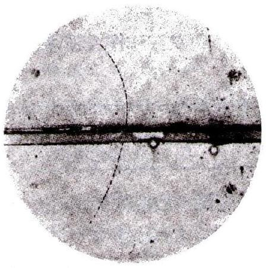
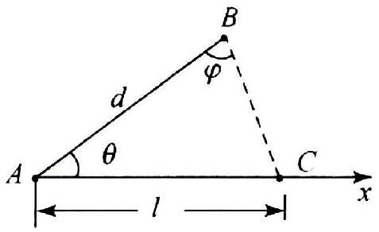
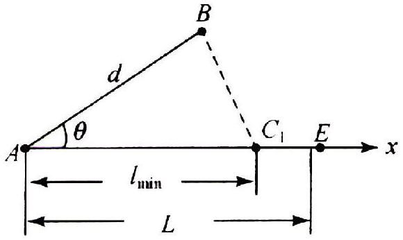
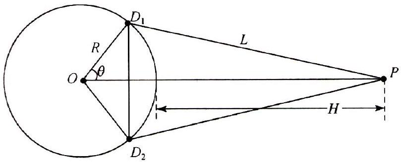
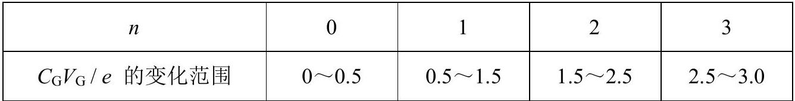
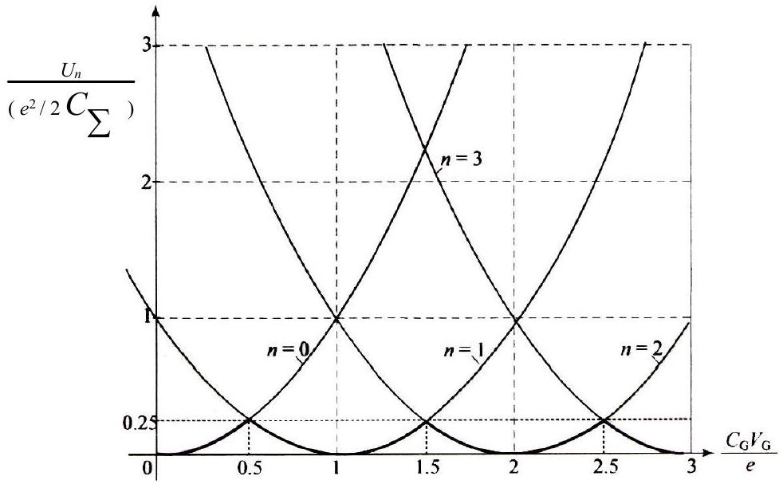
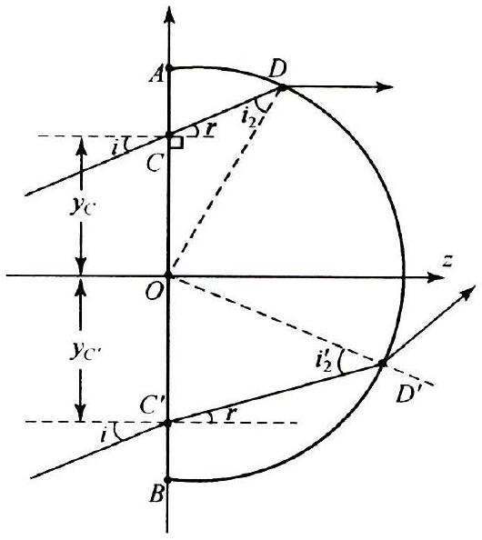
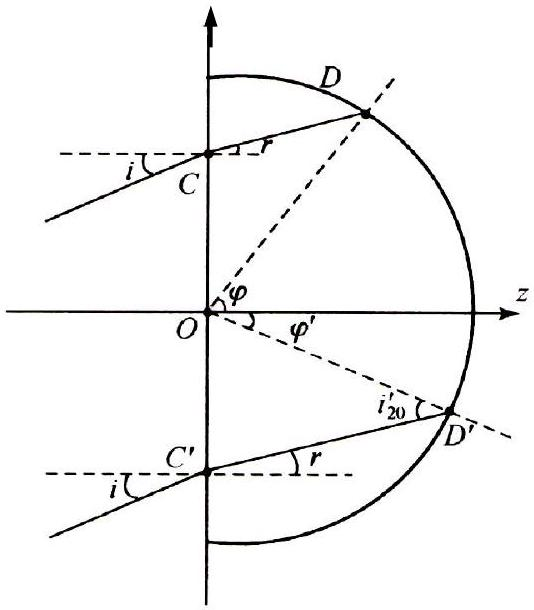

## 七、

1．假设对氦原子基态采用玻尔模型，认为每个电子都在以氦核为中心的圆周上运动，半径相同，角动量均为 $\hbar: \hbar=h / 2 \pi$ ，其中 $h$ 是普朗克常量．
（I）如果忽略电子间的相互作用，氦原子的一级电离能是多少电子伏？一级电离能是指把其中一个电子移到无限远所需要的能量。
（II）实验测得的氦原子一级电离能是24．6 eV ．若在上述玻尔模型的基础上来考虑电子之间的相互作用，进一步假设两个电子总处于通过氦核的一条直径的两端。试用此模型和假设，求出电子运动轨道的半径 $r_{0}$ 、基态能量 $E_{0}$ 以及一级电离能 $E^{+}$，并与实验测得的氦原子一级电离能相比较。

已知电子质量 $m=0.511 \mathrm{MeV} / c^{2}, c$ 是光速，组合常量 $\hbar c=197.3 \mathrm{MeV} \bullet \mathrm{fm}=197.3 \mathrm{eV}$ $\bullet \mathrm{nm}, ~ k e^{2}=1.44 \mathrm{MeV} \bullet \mathrm{fm}=1.44 \mathrm{eV} \bullet \mathrm{nm}, k$ 是静电力常量，$e$ 是基本电荷量．
2．右图是某种粒子穿过云室留下的径迹的照片。径迹在纸面内，图的中间是一块与纸面垂直的铅板，外加恒定匀强磁场的方向垂直纸面向里．假设粒子电荷的大小是一个基本电荷量 $e: e=1.60$ $\times 10^{-19} \mathrm{C}$ ，铅板下部径迹的曲率半径 $r_{\mathrm{d}}=210 \mathrm{~mm}$ ，铅板上部径迹的曲率半径 $r_{\mathrm{u}}=76.0 \mathrm{~mm}$ ，铅板内的径迹与铅板法线成 $\theta=15.0^{\circ}$ ，铅板厚度 $d=6.00 \mathrm{~mm}$ ，磁感应强度 $B=1.00 \mathrm{~T}$ ，粒子质量 $m=9.11 \times 10^{-31} \mathrm{~kg}=0.511$

$\mathrm{MeV} / c^{2}$ 。不考虑云室中气体对粒子的阻力。
（I）写出粒子运动的方向和电荷的正负．
（II）试问铅板在粒子穿过期间所受的力平均为多少牛？
（III）假设射向铅板的不是一个粒子，而是从加速器引出的流量为 $j=5.00 \times 10^{18} / \mathrm{s}$ 的脉冲粒子束，一个脉冲持续时间为 $\tau=2.50 \mathrm{~ns}$ 。试问铅板在此脉冲粒子束穿过期间所受的力平均为多少牛？铅板在此期间吸收的热量又是多少焦？

## 第25届全国中学生物理竞赛决赛参考解答

一、
1．解法一：设守方队员经过时间 $t$ 在 $A x$ 上的 $C$点抢到球，用 $l$ 表示 $A$ 与 $C$ 之间的距离，$l_{\mathrm{p}}$ 表示 $B$ 与$C$ 之间的距离（如图1所示），则有

$$
l=v t, l_{\mathrm{p}}=v_{\mathrm{p}} t
$$

图 1

和

$$
l_{\mathrm{p}}^{2}=d^{2}+l^{2}-2 d l \cos \theta .
$$

解式（1），（2）可得

$$
l=\frac{d}{1-\left(v_{\mathrm{p}} / v\right)^{2}}\left\{\cos \theta \pm\left[\left(\frac{v_{\mathrm{p}}}{v}\right)^{2}-\sin ^{2} \theta\right]^{1 / 2}\right\} .
$$

由式（3）可知，球被抢到的必要条件是该式有实数解，即

$$
v_{\mathrm{p}} \geqslant v \sin \theta .
$$

解法二：设 $B A$ 与 $B C$ 的夹角为 $\varphi$（如图1）。按正弦定理有

$$
\frac{l_{\mathrm{p}}}{\sin \theta}=\frac{l}{\sin \varphi} .
$$

利用式（1）有

$$
\frac{v_{\mathrm{p}}}{v}=\frac{\sin \theta}{\sin \varphi} .
$$

从 $\sin \varphi \leqslant 1$ 可得必要条件（4）．
2．用 $l_{\text {min }}$ 表示守方队员能抢断球的地方与 $A$ 点间的最小距离。由式（3）知

$$
l_{\min }=\frac{d}{1-\left(v_{\mathrm{p}} / v\right)^{2}}\left\{\cos \theta \pm\left[\left(\frac{v_{\mathrm{p}}}{v}\right)^{2}-\sin ^{2} \theta\right]^{1 / 2}\right\} .
$$

若攻方接球队员到 $A$ 点的距离小于 $l_{\text {min }}$ ，则他将先控制球而不被守方队员抢断。故球不被抢断的条件是

$$
l_{\mathrm{r}}<l_{\min } .
$$

由（5），（6）两式得

$$
l_{\mathrm{r}}<\frac{d}{1-\left(v_{\mathrm{p}} / v\right)^{2}}\left\{\cos \theta \pm\left[\left(\frac{v_{\mathrm{p}}}{v}\right)^{2}-\sin ^{2} \theta\right]^{1 / 2}\right\}
$$

由式（7）可知，若位于 $A x$ 轴上等球的攻方球员到 $A$ 点的距离 $l_{\mathrm{r}}$ 满足该式，则球不被原位于 $B$ 处的守方球员抢断．

3．解法一：如果在位于 $B$ 处的守方球员到达 $A x$ 上距离 $A$ 点 $l_{\min }$ 的 $C_{1}$ 点之前，

攻方接球队员能够到达距 $A$ 点小于 $l_{\text {min }}$ 处，球就不会被原位于 $B$ 处的守方队员抢断（如图2所示）．若 $L \leqslant l_{\text {min }}$ 就相当于第2小题．若 $L> l_{\text {min }}$ ，设攻方接球员位于 $A x$ 方向上某点 $E$ 处，则他跑到 $C_{1}$ 点所需时间

$$
t_{\mathrm{rm}}=\left(L-l_{\min }\right) / v_{\mathrm{r}} ;
$$

守方队员到达 $C_{1}$ 处所需时间 $t_{\mathrm{pm}}=\left(d^{2}+l_{\text {min }}^{2}\right.$

图2

$\left.-2 d l_{\text {min }} \cos \theta\right)^{1 / 2} / v_{\mathrm{p}} \quad$.

球不被守方抢断的条件是

$$
t_{\mathrm{rm}}<t_{\mathrm{pm}} .
$$

即

$$
L<\frac{v_{\mathrm{r}}}{v_{\mathrm{p}}}\left(d^{2}+l_{\min }^{2}-2 d l_{\min } \cos \theta\right)^{1 / 2}+l_{\min },
$$

式中 $l_{\text {min }}$ 由式（5）给出。
解法二：守方队员到达 $C_{1}$ 点的时间和球到达该点的时间相同，因此有

$$
t_{\mathrm{pm}}=l_{\min } / v .
$$

从球不被守方队员抢断的条件（9）以及式（8）可得到

$$
L<\left(1+v_{\mathrm{r}} / v\right) l_{\min }
$$

式中 $l_{\text {min }}$ 也由式（5）给出．易证明式（11）与（10）相同。

## 二、

1．（I）选择一个坐标系来测定卫星的运动，就是测定每一时刻卫星的位置坐标 $x, y$ ，$z$ ．设卫星在 $t$ 时刻发出的信号电波到达第 $i$ 个地面站的时刻为 $t_{i}$ 。因为卫星信号电波以光速 $c$ 传播，于是可以写出

$$
\left(x-x_{i}\right)^{2}+\left(y-y_{i}\right)^{2}+\left(z-z_{i}\right)^{2}=c^{2}\left(t-t_{i}\right)^{2} \quad(i=1,2,3),
$$

式中 $x_{i}, y_{i}, z_{i}$ 是第 $i$ 个地面站的位置坐标，可以预先测定，是已知的；$t_{i}$ 也可以由地面站的时钟来测定；$t$ 由卫星信号电波给出，也是已知的。所以，方程（1）中有三个未知数 $x, y, z$ ，要有三个互相独立的方程，也就是说，至少需要包含三个地面站，三个方程对应于式（1）中 $i=1,2,3$ 的情况。
（II）（i）如图所示，以地心 $O$和两个观测站 $D_{1}$ ，$D_{2}$ 的位置为顶点所构成的三角形是等腰三角形，腰长为 $R$ ．根据题意，可知

卫星发出信号电波时距离两个观测站的距离相等，都是

$$
L=c \tau .
$$

当卫星 $P$ 处于上述三角形所在的平面内时，距离地面的高度最大，即 $H$ ．以 $\theta$ 表示$D_{1}, ~ D_{2}$ 所处的纬度，由余弦定理可知

$$
L^{2}=R^{2}+(H+R)^{2}-2 R(H+R) \cos \theta .
$$

由（2），（3）两式得

$$
H=\sqrt{(c \tau)^{2}-(R \sin \theta)^{2}}-R(1-\cos \theta) .
$$

式（4）也可据图直接写出。
（ii）按题意，如果纬度有很小的误差 $\triangle \theta$ ，则由式（3）可知，将引起 $H$ 发生误差 $\triangle H$ ．这时有

$$
L^{2}=R^{2}+(H+\triangle H+R)^{2}-2 R(H+\triangle H+R) \cos (\theta+\triangle \theta) .
$$

将式（5）展开，因 $\triangle \theta$ 很小，从而 $\triangle H$ 也很小，可略去高次项，再与式（3）相减，得

$$
\Delta H=-\frac{R(R+H) \sin \theta \triangle \theta}{H+(1-\cos \theta) R},
$$

其中 $H$ 由（4）式给出。
（iii）如果时间 $\tau$ 有 $\triangle \tau$ 的误差，则 $L$ 有误差

$$
\triangle L=c \triangle \tau .
$$

由式（3）可知，这将引起 $H$ 产生误差 $\triangle H$ ．这时有

$$
(L+\triangle L)^{2}=R^{2}+(H+\triangle H+R)^{2}-2 R(H+\triangle H+R) \cos \theta .
$$

由式（7），（8）和（3），略去高次项，可得

$$
\Delta H=\frac{c^{2} \tau \triangle \tau}{H+R(1-\cos \theta)},
$$

其中 $H$ 由式（4）给出。
2．（i）在式（4）中代入数据，算得 $H=2.8 \times 10^{4} \mathrm{~km}$ 。（ii）在式（6）中代入数据，算得 $\triangle H=\mp 25 \mathrm{~m}$ 。（iii）在式（9）中代入数据，算得 $\triangle H= \pm 3.0 \mathrm{~m}$ 。

3．选择一个坐标系，设被测物体待定位置的坐标为 $x, y, z$ ，待定时刻为 $t$ ，第 $i$个卫星在 $t_{i}$ 时刻的坐标为 $x_{i}, y_{i}, z_{i}$ 。卫星信号电波以光速传播，可以写出

$$
\left(x-x_{i}\right)^{2}+\left(y-y_{i}\right)^{2}+\left(z-z_{i}\right)^{2}=c^{2}\left(t-t_{i}\right)^{2} \quad(i=1,2,3,4),
$$

由于方程（1）有四个未知数 $t, x, y, z$ ，需要四个独立方程才有确定的解，故需同时接收至少四个不同卫星的信号。确定当时物体的位置和该时刻所需要的是式（10）中 $i$
＝1，2 ，3 ，4 所对应的四个独立方程。
4．（I）由于卫星上钟的变慢因子为 $\left[1-(v / c)^{2}\right]^{1 / 2}$ ，地上的钟的示数 $T$ 与卫星上的钟的示数 $t$ 之差为

$$
T-t=T-\sqrt{1-\left(\frac{v}{c}\right)^{2}} T=\left[1-\sqrt{1-\left(\frac{v}{c}\right)^{2}}\right] T,
$$

这里 $v$ 是卫星相对地面的速度，可由下列方程定出：

$$
\frac{v^{2}}{r}=\frac{G M}{r^{2}},
$$

其中 $G$ 是万有引力常量，$M$ 是地球质量，$r$ 是轨道半径。式（11）给出

$$
v=\sqrt{\frac{G M}{r}}=\sqrt{\frac{g}{r}} R=\sqrt{\frac{g}{R+h}} R,
$$

其中 $R$ 是地球半径，$h$ 是卫星离地面的高度，$g=G M / R^{2}$ 是地面重力加速度；代入数值有 $v=3.89 \mathrm{~km} / \mathrm{s}$ ．于是 $(v / c)^{2} \approx 1.68 \times 10^{-10}$ ，这是很小的数。所以

$$
\left[1-\left(\frac{v}{c}\right)^{2}\right]^{1 / 2} \approx 1-\frac{1}{2}\left(\frac{v}{c}\right)^{2} .
$$

最后，可以算出 24 h 的时差

$$
T-t \approx \frac{1}{2}\left(\frac{v}{c}\right)^{2} T=\frac{1}{2} \frac{g R^{2}}{c^{2}(R+h)} T=7.3 \mu \mathrm{~s} .
$$

（II）卫星上的钟的示数 $t$ 与无限远惯性系中的钟的示数 $T_{0}$ 之差

$$
t-T_{0}=\sqrt{1-2 \frac{\phi}{c^{2}}} T_{0}-T_{0}=\left(\sqrt{1-2 \frac{\phi}{c^{2}}}-1\right) T_{0} .
$$

卫星上的钟所处的重力势能的大小为

$$
\phi=\frac{G M}{R+h}=\frac{R^{2}}{R+h} g .
$$

所以 $\frac{\phi}{c^{2}}=\frac{g R^{2}}{c^{2}(R+h)}$ ；
代入数值有 $\phi / c^{2}=1.68 \times 10^{-10}$ ，这是很小的数。式（14）近似为

$$
t-T_{0} \approx-\frac{\phi}{c^{2}} T_{0} .
$$

类似地，地面上的钟的示数 $T$ 与无限远惯性系的钟的示数之差

$$
T-T_{0}=\sqrt{1-2 \frac{\phi_{E}}{c^{2}}} T_{0}-T_{0}=\left(\sqrt{1-2 \frac{\phi_{E}}{c^{2}}}-1\right) T_{0} .
$$

地面上的钟所处的重力势能的大小为

$$
\phi_{E}=\frac{G M}{R}=g R .
$$

所以 $\frac{\phi_{E}}{c^{2}}=\frac{g R}{c^{2}}$ ；
代入数值有 $\phi_{E} / c^{2}=6.96 \times 10^{-10}$ ，这是很小的数。与上面的情形类似，式（17）近似为

$$
T-T_{0} \approx-\frac{\phi_{E}}{c^{2}} T_{0}
$$

（16），（19）两式相减，即得卫星上的钟的示数与地面上的钟的示数之差

$$
t-T \approx-\frac{\phi-\phi_{E}}{c^{2}} T_{0}
$$

从式（19）中解出 $T_{0}$ ，并代入式（20）得

$$
t-T \approx-\frac{\phi-\phi_{E}}{c^{2}} /\left(1-\frac{\phi_{E}}{c^{2}}\right) T \approx-\frac{\phi-\phi_{E}}{c^{2}} T=\frac{g R}{c^{2}} \frac{h}{R+h} T .
$$

注意，题目中的 24 h 是指地面的钟走过的时间 $T$ 。最后，算出24 h 卫星上的钟的示数与地面上的钟的示数之差

$$
t-T=46 \mu \mathrm{~s} .
$$

## 三、

1．依题意，为使室内温度保持不变，热泵向室内放热的功率应与房间向室外散热的功率相等。设热泵在室内放热的功率为 $q$ ，需要消耗的电功率为 $P$ ，则它从室外（低温处）吸收热量的功率为 $q-P$ 。根据题意有

$$
\frac{q-P}{P} \leqslant \frac{T_{2}}{T_{1}-T_{2}},
$$

式中 $T_{1}$ 为室内（高温处）的绝对温度，$T_{2}$ 为室外的绝对温度．由（1）式得

$$
P \geqslant \frac{T_{1}-T_{2}}{T_{1}} q .
$$

显然，为使电费最少，$P$ 应取最小值；即式（2）中的＂$\geqslant$＂号应取等号，对应于理想情况下 $P$ 最小。故最小电功率

$$
P_{\min }=\frac{T_{1}-T_{2}}{T_{1}} q .
$$

又依题意，房间由玻璃板通过热传导方式向外散热，散热的功率

$$
H=k \frac{T_{1}-T_{2}}{l} S .
$$

要保持室内温度恒定，应有

$$
q=H .
$$

由（3）～（5）三式得

$$
P_{\min }=k \frac{S\left(T_{1}-T_{2}\right)^{2}}{l T_{1}} .
$$

设热泵工作时间为 $t$ ，每度电的电费为 $c$ ，则热泵工作需花费的最少电费

$$
C_{\min }=P_{\min } t c .
$$

注意到 $T_{1}=20.00 \mathrm{~K}+273.15 \mathrm{~K}=293.15 \mathrm{~K}$ ，$T_{2}=-5.00 \mathrm{~K}+273.15 \mathrm{~K}=268.15 \mathrm{~K}$ ， 1度电 $=1 \mathrm{~kW} \cdot \mathrm{~h}$ 。由（6），（7）两式，并代入有关数据得

$$
C_{\min }=\frac{\left(T_{1}-T_{2}\right)^{2}}{T_{1} l} S k t c=23.99 \text { 元. }
$$

所以，在理想情况下，该热泵工作12 h需约24元电费。
2．设中间空气层内表面的温度为 $T_{\mathrm{i}}$ ，外表面的温度为 $T_{0}$ ，则单位时间内通过内层玻璃、中间空气层和外层玻璃传导的热量分别为

$$
\begin{aligned}
& H_{1}=k \frac{T_{1}-T_{\mathrm{i}}}{l} S, \\
& H_{2}=k_{0} \frac{T_{\mathrm{i}}-T_{0}}{l_{0}} S, \\
& H_{3}=k \frac{T_{0}-T_{2}}{l} S .
\end{aligned}
$$

在稳定传热的情况下，有

$$
H_{1}=H_{2}=H_{3} .
$$

由（9）～（12）四式得

$$
k \frac{T_{1}-T_{\mathrm{i}}}{l}=k_{0} \frac{T_{\mathrm{i}}-T_{0}}{l_{0}} \quad \text { 和 } \quad T_{1}-T_{\mathrm{i}}=T_{0}-T_{2} .
$$

解式（13）得

$$
T_{\mathrm{i}}=\frac{l_{0} k+l k_{0}}{l_{0} k+2 l k_{0}} T_{1}+\frac{l k_{0}}{l_{0} k+2 l k_{0}} T_{2} .
$$

将（14）式代入（9）式得

$$
H_{1}=\frac{k k_{0}}{l_{0} k+2 l k_{0}}\left(T_{1}-T_{2}\right) S .
$$

要保持室内温度恒定，应有 $q=H_{1}$ 。由式（3）知，在双层玻璃情况下热泵消耗的最小电功率

$$
P_{\min }^{\prime}=\frac{k k_{0}}{l_{0} k+2 l k_{0}} \frac{\left(T_{1}-T_{2}\right)^{2}}{T_{1}} S .
$$

在理想情况下，热泵工作时间 $t$ 需要的电费

$$
C^{\prime}{ }_{\min }=P_{\min }^{\prime} t c ;
$$

代入有关数据得

$$
C^{\prime}{ }_{\min }=2.52 \text { 元 . }
$$

所以，改用所选的双层玻璃板后，该热泵工作 12 h 可以节约的电费

$$
\triangle C_{\min }=C_{\min }-C^{\prime}{ }_{\min }=21.47 \text { 元. }
$$

四、
1．先假设由于隧穿效应，单电子能从电容器的极板 $A$ 隧穿到极板 $B$ ．以 $Q$ 表示单电子隧穿前极板 $A$ 所带的电荷量，$V_{\mathrm{AB}}$ 表示两极板间的电压（如题目中图3所示），则有

$$
V_{\mathrm{AB}}=Q / C .
$$

这时电容器储能

$$
U=\frac{1}{2} C V^{2}{ }_{\mathrm{AB}} .
$$

当单电子隧穿到极板 $B$ 后，极板 $A$ 所带的电荷量为

$$
Q^{\prime}=Q+e,
$$

式中 $e$ 为电子电荷量的大小．这时，电容器两极板间的电压和电容器分别储能为

$$
V_{\mathrm{AB}}^{\prime}=\frac{Q+e}{C}, \quad U^{\prime}=\frac{1}{2} C V^{\prime 2}{ }_{\mathrm{AB}} .
$$

若发生库仑阻塞，即隧穿过程被禁止，则要求

$$
U^{\prime}-U>0 .
$$

由（1）～（5）五式得

$$
V_{\mathrm{AB}}>-\frac{1}{2} \frac{e}{C} .
$$

再假设单电子能从电容器的极板 $B$ 隧穿到极板 $A$ ．仍以 $Q$ 表示单电子隧穿前极板 $A$所带的电荷量，$V_{\mathrm{AB}}$ 表示两极板间的电压．当单电子从极板 $B$ 隧穿到极板 $A$ 时，极板 $A$ 所带的电荷量为 $Q^{\prime}=Q-e$ 。经过类似的计算，可得单电子从极板 $B$ 到极板 $A$ 的隧穿不能发生的条件是

$$
V_{\mathrm{AB}}<\frac{1}{2} \frac{e}{C} .
$$

由（6），（7）两式知，当电压 $V_{\mathrm{AB}}$ 在 $-e / 2 C \sim e / 2 C$ 之间时，单电子隧穿受到库仑阻塞，即库仑阻塞的条件为

$$
-\frac{1}{2} \frac{e}{C}<V_{\mathrm{AB}}<\frac{1}{2} \frac{e}{C} .
$$

2．依题意和式（8）可知，恰好能发生隧穿时有

$$
V_{\mathrm{AB}}=\frac{1}{2} \frac{e}{C}=0.10 \mathrm{mV} .
$$

由式（9），并代入有关数据得

$$
C=8.0 \times 10^{-16} \mathrm{~F} \text {. }
$$

3．设题目中图3中左边的 MIM 结的电容为$C_{\mathrm{S}}$ ，右边的 MIM 结的电容为 $C_{\mathrm{D}}$ 。双结结构体系如图 a 所示，以 $Q_{1}, ~ Q_{2}$ 分别表示电容 $C_{\mathrm{S}}$ ，$C_{\mathrm{D}}$ 所带的电荷量．根据题意，中间单电子岛上的电荷量为

$$
-n e=Q_{2}-Q_{1} .
$$

体系的静电能为 $C_{\mathrm{S}}$ 和 $C_{\mathrm{D}}$ 中静电能的总和，即

$$
U=\frac{Q_{1}^{2}}{2 C_{\mathrm{S}}}+\frac{Q_{2}^{2}}{2 C_{\mathrm{D}}} ;
$$

电压

$$
V=\frac{Q_{1}}{C_{\mathrm{S}}}+\frac{Q_{2}}{C_{\mathrm{D}}} .
$$

由（11）～（13）三式解得

$$
U=\frac{1}{2} C V^{2}+\frac{\left(Q_{2}-Q_{1}\right)^{2}}{2\left(C_{\mathrm{S}}+C_{\mathrm{D}}\right)} .
$$

由于 $V$ 为恒量，从式（13）可知体系的静电能中与岛上净电荷相关的静电能 $U_{n}=$（一 $n e)^{2} / 2\left(C_{\mathrm{S}}+C_{\mathrm{D}}\right)$ ．

4．$U_{n}$ 随 $C_{\mathrm{G}} V_{\mathrm{G}}$ 变化的图线如图 b；$C_{\mathrm{G}} V_{\mathrm{G}} / e$ 的变化范围如表2．

表 2

图 b

五、
1．在图1中，$z$ 轴垂直于 $A B$ 面．考察平行光束中两条光线分别在 $A B$ 面上 $C$ 与 $C^{\prime}$ 点以入射角 $i$射入透明圆柱时的情况，$r$ 为折射角，在圆柱体中两折射光线分别射达圆柱面的 $D$ 和 $D^{\prime}$ ，对圆柱面其入射角分别为 $i_{2}$ 与 $i^{\prime}{ }_{2}$ 。在 $\triangle O C D$ 中，$O$ 点与入射点 $C$ 的距离 $y_{c}$ 由正弦定理得

$$
\frac{y_{c}}{\sin i_{2}}=\frac{R}{\sin \left(90^{\circ}+r\right)} \text {, 即 } y_{c}=\frac{\sin i_{2}}{\cos r} R \text {. }
$$

图 1

同理在 $\triangle O C^{\prime} D^{\prime}$ 中，$O$ 点与入射点 $C^{\prime}$ 的距离有

$$
\frac{y_{c^{\prime}}}{\sin i^{\prime}{ }_{2}}=\frac{R}{\sin \left(90^{\circ}-r\right)} \text {, 即 } y_{c^{\prime}}=\frac{\sin i^{\prime}{ }_{2}}{\cos r} R \text {. }
$$

当改变入射角 $i$ 时，折射角 $r$ 与柱面上的入射角 $i_{2}$ 与 $i_{2}^{\prime}$ 亦随之变化．在柱面上的入射角满足临界角

$$
i_{20}=\arcsin (1 / n) \approx 41.8^{\circ}
$$

时，发生全反射．将 $i_{2}=i^{\prime}{ }_{2}=i_{20}$ 分别代入式（1），（2）得

$$
y_{\mathrm{oc}}=y_{\mathrm{oc}}=\frac{\sin i_{20}}{\cos r} R,
$$

即

$$
d=2 y_{\mathrm{oc}}=2 \frac{\sin i_{20}}{\cos r} R .
$$

当 $y_{c}>y_{\mathrm{o} c}$ 和 $y_{c^{\prime}}>y_{\mathrm{o} c^{\prime}}$ 时，入射光线进入柱体，经过折射后射达柱面时的入射角大于临界角 $i_{20}$ ，由于发生全反射不能射出柱体．因折射角 $r$ 随入射角 $i$ 增大而增大．由式（4）知，当 $r=0$ ，即 $i=0$（垂直入射）时，$d$ 取最小值

$$
d_{\min }=2 R \sin i_{20}=1.33 R .
$$

当 $i \rightarrow 90^{\circ}$（掠入射）时，$r \rightarrow 41.8^{\circ}$ 。将 $r=41.8^{\circ}$ 代入式（4）得 $d_{\text {max }}=1.79 R$ 。（7）

2．由图2可见，$\varphi$ 是 $O z$ 轴与线段 $O D$ 的夹角，$\varphi^{\prime}$ 是 $O z$ 轴与线段 $O D^{\prime}$ 的夹角．发生全反射时，有

$$
\begin{aligned}
& \varphi=i_{20}+r, \\
& \varphi^{\prime}=i_{20}-r,
\end{aligned}
$$

和

$$
\theta=\varphi+\varphi^{\prime}=2 i_{20} \approx 83.6^{\circ} .
$$

由此可见，$\theta$ 与 $i$ 无关，即 $\theta$ 独立于 $i$ 。在掠入射

图2

时，$i \approx 90^{\circ}, r=41.8^{\circ}$ ，由式（8），（9）两式得

$$
\varphi=83.6^{\circ}, \varphi^{\prime}=0^{\circ} .
$$

六、
由于方程

$$
r=\frac{G M / c^{2}}{a \cos \varphi+a^{2}\left(1+\sin ^{2} \varphi\right)}
$$

是 $\varphi$ 的偶函数，光线关于极轴对称．光线在坐标原点左侧的情形对应于 $a<0$ ；光线在坐标原点右侧的情形对应 $a>0$ ．右图是 $a<0$ 的情形，图中极轴为 $O x$ ，白矮星在原点 $O$ 处。在式（1）中代入近星点坐标 $r=r_{\mathrm{m}}, \varphi=\pi$ ，并注意到 $a^{2} \square|a|$ ，有

$$
a \approx-G M / c^{2} r_{\mathrm{m}} .
$$

经过白矮星两侧的星光对观测者所张的视角 $\theta_{\mathrm{S}}$ 可以有不同的表达方式，相应的问题有不同的解法．

解法一：若从白矮星到地球的距离为 $d$ ，则可近似地写出

$$
\theta_{\mathrm{S}} \approx 2 r_{\mathrm{m}} / d
$$

在式（1）中代入观测者的坐标 $r=d, \varphi=-\pi / 2$ ，有

$$
a^{2} \approx G M / 2 c^{2} d .
$$

由（2）与（4）两式消去 $a$ ，可以解出

$$
r_{\mathrm{m}}=\sqrt{2 G M d / c^{2}} .
$$

把式（5）代入式（3）得

$$
\theta_{\mathrm{S}} \approx \sqrt{8 G M / c^{2} d} ;
$$

即

$$
M \approx \theta_{\mathrm{S}}^{2} c^{2} d / 8 G
$$

其中 $d=3.787 \times 10^{17} \mathrm{~m}$ ；代入数值就可算出

$$
M \approx 2.07 \times 10^{30} \mathrm{~kg} .
$$

解法二：光线射向无限远处的坐标可以写成

$$
r \rightarrow \infty, \varphi=-\frac{\pi}{2}+\frac{\theta}{2} .
$$

近似地取 $\theta_{\mathrm{S}} \approx \theta$ ，把式（9）代入式（1），要求式（1）分母为零，并注意到 $\theta \square 1$ ，有

$$
a \theta / 2+2 a^{2}=0 .
$$

所以

$$
\theta_{\mathrm{S}} \approx \theta=-4 a=\sqrt{8 G M / c^{2} d}
$$

其中用到式（4），并注意到 $a<0$ 。式（10）与式（6）相同，从而也有式（8）。

解法三：星光对观测者所张的视角 $\theta_{\mathrm{S}}$ 应等于两条光线在观测者处切线的夹角，有

$$
\sin \frac{\theta_{\mathrm{S}}}{2}=\frac{\triangle(r \cos \varphi)}{\triangle r}=\cos \varphi-r \sin \varphi \frac{\triangle \varphi}{\triangle r} .
$$

由光线方程（1）算出 $\triangle \varphi / \triangle r$ ，有

$$
\sin \frac{\theta_{\mathrm{S}}}{2}=\cos \varphi-r \sin \varphi \frac{G M / c^{2}}{r^{2} a \sin \varphi}=\cos \varphi-\frac{G M}{c^{2} r a} ;
$$

代入观测者的坐标 $r=d, \phi=-\pi / 2$ 以及 $a$ 的表达式（4），并注意到 $\theta \mathrm{S}$ 很小，就有

$$
\theta_{\mathrm{S}} \approx \frac{2 G M}{c^{2} d} \sqrt{\frac{2 c^{2} d}{G M}}=\sqrt{\frac{8 G M}{c^{2} d}},
$$

与式（6）相同。所以，也得到了式（8）。
解法四：用式（2）把方程（1）改写成

$$
-r_{\mathrm{m}}=r \cos \varphi-\frac{G M}{c^{2} r_{\mathrm{m}} r}\left[(r \cos \varphi)^{2}+2(r \sin \varphi)^{2}\right],
$$

即

$$
x=-r_{\mathrm{m}}+\frac{G M}{c^{2} r_{\mathrm{m}} r}\left(x^{2}+2 y^{2}\right) .
$$

当 $y \rightarrow-\infty$ 时，式（12）的渐近式为

$$
x=-r_{\mathrm{m}}-\frac{2 G M}{c^{2} r_{\mathrm{m}}} y .
$$

这是直线方程，它在 $x$ 轴上的截距为 $-r_{\mathrm{m}}$ ，斜率为

$$
\frac{1}{-2 G M / c^{2} r_{\mathrm{m}}} \approx \frac{1}{-\tan \left(\theta_{\mathrm{s}} / 2\right)} \approx-\frac{1}{\theta_{\mathrm{s}} / 2} .
$$

于是有 $\theta_{\mathrm{S}} \approx 4 G M / c^{2} r_{\mathrm{m}} . r_{\mathrm{m}}$ 用式（5）代入后，得到式（6），从而也有式（8）。
七、
1．（I）氦原子中有两个电子，一级电离能 $E^{+}$是把其中一个电子移到无限远处所需要的能量满足 $\mathrm{He}+E^{+} \rightarrow \mathrm{He}^{+}+\mathrm{e}^{-}$。为了得到氦原子的一级电离能 $E^{+}$，需要求出一个电子电离以后氦离子体系的能量 $E^{*}$ 。这是一个电子围绕氦核运动的体系，下面给出两种解法。

解法一：在力学方程

$$
\frac{2 k e^{2}}{r^{2}}=\frac{m v^{2}}{r}
$$

中，$r$ 是轨道半径，$v$ 是电子速度。对基态，用玻尔量子化条件（角动量为 $\hbar$ ）可以解出

$$
r_{0}=\hbar^{2} / 2 k e^{2} m .
$$

于是氦离子能量

$$
E^{*}=\frac{p_{0}^{2}}{2 m}-\frac{2 k e^{2}}{r_{0}}=-\frac{2 k^{2} e^{4} m}{\hbar^{2}},
$$

其中 $p_{0}$ 为基态电子动量的大小；代入数值得

$$
E^{*}=-\frac{2\left(k e^{2}\right)^{2} m c^{2}}{(\hbar c)^{2}} \approx-54.4 \mathrm{eV} .
$$

由于不计电子间的相互作用，氦原子基态的能量 $E_{0}$ 是该值的2倍，即

$$
E_{0}=2 E^{*} \approx-108.8 \mathrm{eV} .
$$

氦离子能量 $E^{*}$ 与氦原子基态能量 $E_{0}$ 之差就是氦原子的一级电离能

$$
E^{+}=E^{*}-E_{0}=-E^{*} \approx 54.4 \mathrm{eV} .
$$

解法二：氦离子能量

$$
E^{*}=\frac{p^{2}}{2 m}-\frac{2 k e^{2}}{r} .
$$

把基态的角动量关系 $r p=\hbar$ 代入，式（3）可以改写成

$$
E^{*}=\frac{\hbar^{2}}{2 m r^{2}}-\frac{2 k e^{2}}{r}=\frac{\hbar^{2}}{2 m}\left(\frac{1}{r}-\frac{2 k e^{2} m}{\hbar^{2}}\right)^{2}-\frac{2 k^{2} e^{4} m}{\hbar^{2}} .
$$

因基态的能量最小，式（4）等号右边的第一项为零，所以半径和能量

$$
r_{0}=\frac{\hbar^{2}}{2 k e^{2} m}, \quad E^{*}=-\frac{2 k^{2} e^{4} m}{\hbar^{2}}
$$

分别与（1），（2）两式相同。
（II）下面，同样给出求氦原子基态能量 $E_{0}$ 和半径 $r_{0}$ 的两种解法。
解法一：利用力学方程

$$
\frac{m v^{2}}{r}=\frac{2 k e^{2}}{r^{2}}-\frac{k e^{2}}{(2 r)^{2}}=\frac{7 k e^{2}}{4 r^{2}}
$$

和基态量子化条件 $r m v=\hbar$ ，可以解出半径

$$
r_{0}=4 \hbar^{2} / 7 k e^{2} m,
$$

于是氦原子基态能量

$$
E_{0}=2\left(\frac{p_{0}^{2}}{2 m}-\frac{2 k e^{2}}{r_{0}}\right)+\frac{k e^{2}}{2 r_{0}}=-\frac{49 k^{2} e^{4} m}{16 \hbar^{2}} ;
$$

代入数值算得

$$
\begin{aligned}
E_{0} & =-\frac{49\left(k e^{2}\right)^{2} m c^{2}}{16(\hbar c)^{2}} \approx-83.4 \mathrm{eV} \\
r_{0} & =\frac{4(\hbar c)^{2}}{7 k e^{2} m c^{2}} \approx 0.0302 \mathrm{~nm}
\end{aligned}
$$

所以，氦原子的一级电离能

$$
E^{+}=E^{*}-E_{0} \approx 29.0 \mathrm{eV} .
$$

这仍比实验测得的氦原子一级电离能 24.6 eV 高出 4.4 eV．

解法二：氦原子能量

$$
E=2\left(\frac{p^{2}}{2 m}-\frac{2 k e^{2}}{r}\right)+\frac{k e^{2}}{2 r}=\frac{\hbar^{2}}{m r^{2}}-\frac{7 k e^{2}}{2 r}
$$

可以化成

$$
E=\frac{\hbar^{2}}{m}\left(\frac{1}{r}-\frac{7 k e^{2} m}{4 \hbar^{2}}\right)^{2}-\frac{49 k^{2} e^{4} m}{16 \hbar^{2}} .
$$

当上式等号右边第一项为零时，能量最小。由此可知，基态能量与半径

$$
E_{0}=-\frac{49 k^{2} e^{4} m}{16 \hbar^{2}}, \quad r_{0}=\frac{4 \hbar^{2}}{7 k e^{2} m}
$$

分别与（7），（6）两式相同．
2．（I）粒子从下部射向并穿过铅板向上运动，其电荷为正。
（II）如题图所示，粒子的运动速度 $v$ 与磁场方向垂直，洛伦兹力在纸面内；磁力不改变荷电粒子动量的大小，只改变其方向。若不考虑云室中气体对粒子的阻力，荷电粒子在恒定磁场作用下的运动轨迹就是曲率半径为一定值的圆弧；可以写出其运动方程

$$
q B v=\left|\frac{\Delta p}{\Delta t}\right|=\frac{p \triangle \phi}{\triangle t}=\frac{p v}{r},
$$

其中 $q$ 是粒子电荷，$v$ 是粒子速度的大小，$p$ 是粒子动量的大小，$\triangle \phi$ 是粒子在 $\triangle t$ 时间内转过的角度，$r$ 是轨迹曲率半径．于是有

$$
p=q B r .
$$

按题意，$q=e$ 。用 $p_{\mathrm{d}}$ 和 $p_{\mathrm{u}}$ 分别表示粒子射入铅板和自铅板射出时动量的大小，并在式（1）中代入有关数据，可以算得

$$
p_{\mathrm{d}}=63.0 \mathrm{MeV} / \mathrm{c}, \quad p_{\mathrm{u}}=22.8 \mathrm{MeV} / \mathrm{c} .
$$

注意到当 $p c \square m c^{2}$ 时应使用狭义相对论，从

$$
p=\frac{m v}{\sqrt{1-(v / c)^{2}}} .
$$

中可以得到

$$
v=\frac{c}{\sqrt{1+(m c / p)^{2}}} .
$$

用 $v_{\mathrm{d}}$ 和 $v_{\mathrm{u}}$ 分别表示粒子进入和离开铅板时的速度大小。把式（2）以及 $m=0.511 \mathrm{MeV} / c^{2}$代入式（3），可得

$$
v_{\mathrm{d}} \approx c, \quad v_{\mathrm{u}} \approx c .
$$

于是，粒子穿过铅板的平均速度 $\bar{v}=(1 / 2)\left(v_{\mathrm{d}}+v_{\mathrm{u}}\right) \approx c$ ．用 $\Delta t$ 表示粒子穿过铅板的时

间，则有

$$
\bar{v} \cos \theta \triangle t=d .
$$

再用 $\triangle p_{\mathrm{du}}$ 表示粒子穿过铅板动量改变量的大小，铅板所受到的平均力的大小

$$
f=\frac{\triangle p_{\mathrm{du}}}{\triangle t}=\frac{p_{\mathrm{d}}-p_{\mathrm{u}}}{d /(\bar{v} \cos \theta)} \approx \frac{\left(p_{\mathrm{d}}-p_{\mathrm{u}}\right) c \cos \theta}{d} ;
$$

代入有关数值得

$$
f \approx 1.04 \times 10^{-9} \mathrm{~N} .
$$

（III）一个粒子穿过铅板的时间

$$
\Delta t=\frac{d}{\bar{v} \cos \theta} \approx \frac{d}{c \cos \theta} \approx 2.07 \times 10^{-11} \mathrm{~s}=0.0207 \mathrm{~ns}
$$

比粒子束流的脉冲周期 $\tau=2.50 \mathrm{~ns}$ 小得多。铅板在此脉冲粒子束穿过期间所受的力的平均大小

$$
F \approx\left(p_{\mathrm{d}}-p_{\mathrm{u}}\right) j ;
$$

代入数据得

$$
F=0.107 \mathrm{~N} .
$$

运用式（4），可把粒子能量写成

$$
E=\sqrt{p^{2} c^{2}+m^{2} c^{4}},
$$

所以粒子穿过铅板前后的能量分别为

$$
E_{\mathrm{d}}=\sqrt{p_{\mathrm{d}}^{2} c^{2}+m^{2} c^{4}}=63.0 \mathrm{MeV}, \quad E_{\mathrm{u}}=\sqrt{p_{\mathrm{u}}^{2} c^{2}+m^{2} c^{4}}=22.8 \mathrm{MeV} .
$$

于是，铅板在脉冲粒子束穿过期间所吸收的热量

$$
Q=\left(E_{\mathrm{d}}-E_{\mathrm{u}}\right) j \tau ;
$$

代入数据得

$$
Q=8.04 \times 10^{-2} \mathrm{~J} .
$$

$$
r=f \cot (2 \alpha)
$$

两式联立，可求得

$$
x=R \sin \left(\frac{1}{2} \arctan \frac{f}{r}\right) \text { 。 }
$$

评分标准：正确画出光路图5分，（3）式5分。
