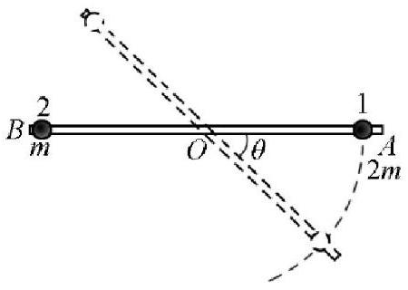

三、（20 分）如图，刚性细轻杆（其质量可视为零）可绕通过其中的点 $O$ 的光滑水平轴在竖直面内自由转动。两质量分别为 $2 m$ 和 $m$ 的小球 1 和 2（可视为质点）串在轻杆上，它们与轻杆之间的静摩擦系数为 $\mu=\frac{5 \sqrt{3}}{6}$ 。开始时轻杆静止在水平位置，小球1和2分别位于紧靠轻杆两端 $A$ 和 $B$ 的位置。现让系统自水平位置以零初速下摆，求

1． 小球 1 脱离轻杆时的位置（用小球 1 脱离杆时杆与水平线的夹角表示）；
2． 小球 2 脱离轻杆时的位置（用小球 2 脱离杆时杆与水平线的夹角表示）。

